# 	AI Coding范式探索与工程实践分享


## 前言：三个需求+1个线上问题，四种挑战

> 随着 Coding Agent 的逐步完善，工程领域的脚手架和 Skill 会越来越多。实际上，AI 已经进入研发工程中的各个环节进行提效：开发、查 Bug、影响范围评估、Code Review 规则扫描……

本篇文章以作者参与的多个不同风格的工程需求为基础，以实战视角带入 AI Coding 工程化落地中的示范。文章试图回答一个核心问题：***\*在真实的企业级直播工程里，AI 和人分别能做什么、各自的边界在哪？\****

这不是一篇"AI 万能论"的文章，也不是"AI 无用论"的文章。是一份在具体需求中反复打磨出来的、诚实的实战与范式记录。


三个需求 + 一个线上问题，覆盖了四种不同的技术挑战类型：

\- ***\*礼物贴纸\****：新技术栈 KRN，研发能力边界受限，如何用 AI 扩展认知边界

\- ***\*送礼链路成组送\****：业务上下文重、技术链路长，如何用 AI 降低理解成本和影响面评估成本

\- ***\*连线模块迁移至简易直播间\****：架构重、技术决策成本高，如何用 AI 做超级大脑扩展

\- ***\*KMP 连麦画面静止\****（线上问题）：多团队协作 + 信息残缺，如何用 AI 快速重建问题现场并定位根因

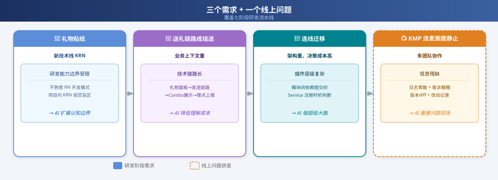

文章结构:

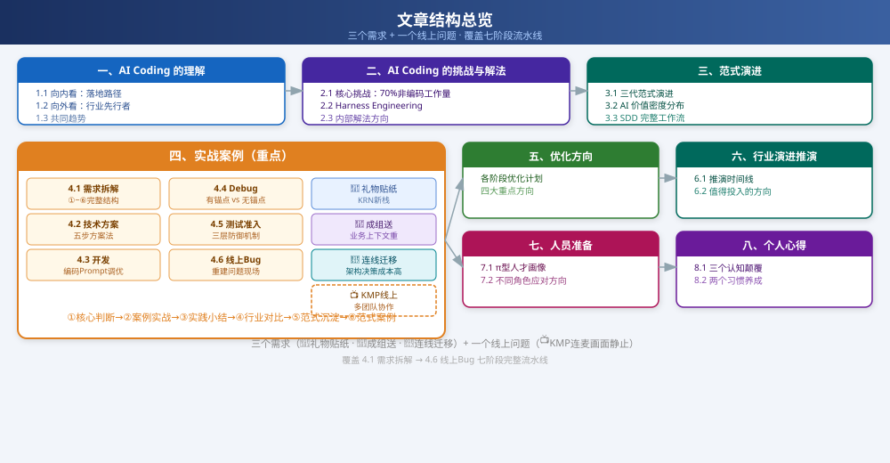

---

# 一、AI Coding 的理解

> 愿景：依托 AI 能力与基座，完成**端到端自主交付**。

---

## 1.1 向内看：落地路径

主站 AI Native 白皮书对于 AI Coding 给出了指向性建议：基于研发知识体系、数据 & 度量体系的数字资产，利用和搭建 AI Infra、AI 友好架构、Agent DEV & OPS & 脚手架，提供研发全链路的 AI 能力，最终完成需求交付。

 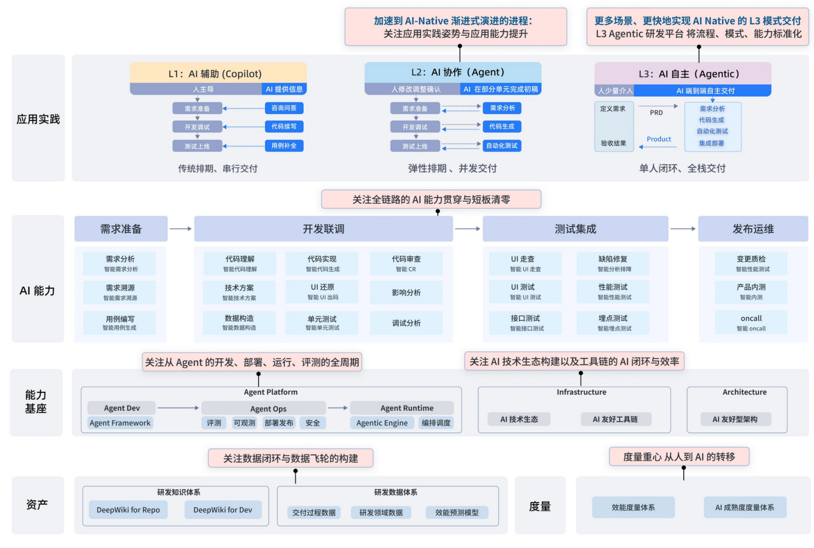

核心路径可以概括为：

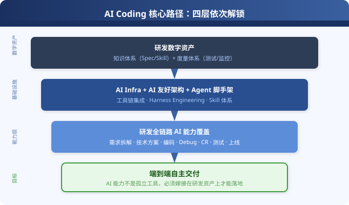

---

## 1.2 向外看：行业先行者

选了两家代表性公司，理解一个新范式最好的方式是——看那些先走一步的人踩出了哪条路。

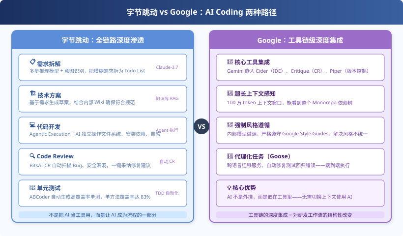

---

## 1.3 共同趋势

两种路径殊途同归，共同指向同一答案：**怎么让 AI 真正变成工程流程的一部分**。

> 这四个趋势，也是后续章节工作流范式和实战案例的底层背景

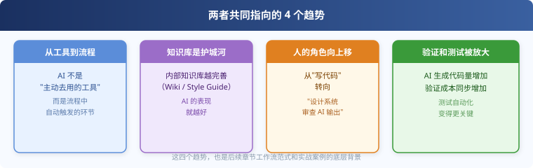

<br/>

---

# 二、AI Coding 的挑战与解法

> AI Coding 工具已高速普及，但"代码写得更快，人反而更累"的矛盾普遍存在。

---

## 2.1 核心挑战：不是工具不够好，是瓶颈在别处

### 挑战一：70% 的非编码工作量被忽视了

AI 极大提升了编码速度，但开发者反而感觉更累——根本原因在此。

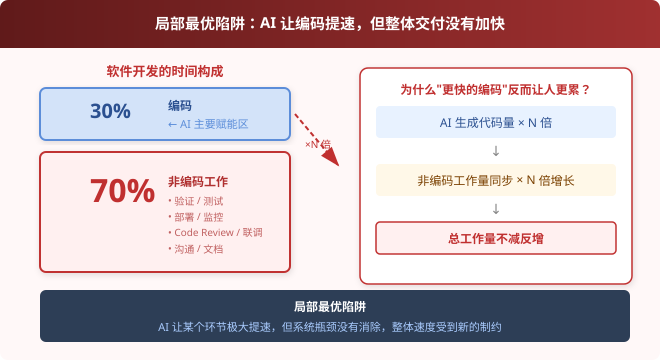

---

### 挑战二：目标传达复杂度是真正的瓶颈

AI Coding 的真正瓶颈**不是 AI 不够强（执行复杂度），而是人无法高效把复杂任务目标传给 AI（目标传达复杂度）**。

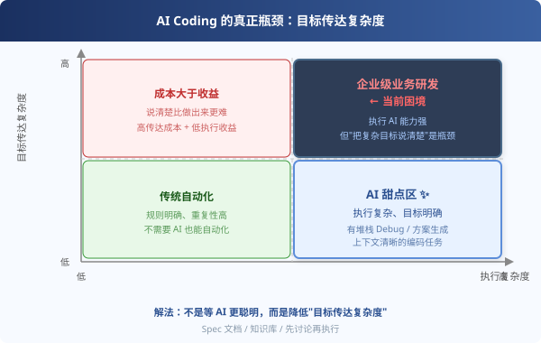

### 挑战三：架构在悄然劣化(没有约束机制的 AI，是架构熵增的加速器)

AI 生成代码量爆发，带来一个难以察觉的问题：每一段局部生成的代码看起来都合理，但整体架构在悄然劣化。

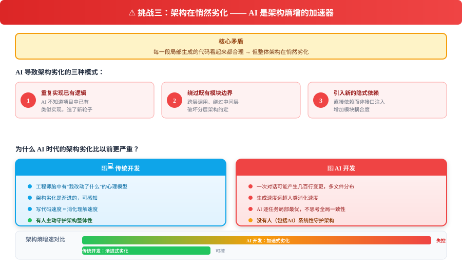


---

## 2.2 行业解法：Harness Engineering

> "不要只把大模型看作'大脑'，必须为它打造专属的'工作室'。"
>
> —— OpenAI 工程团队，2026 年 2 月

这套框架由三层构成：

| 层级                 | 解决什么问题          | 核心实践                                            |
| -------------------- | --------------------- | --------------------------------------------------- |
| **知识层**           | AI 对项目一无所知     | [AGENTS.md](http://agents.md/)、架构文档、业务 Spec |
| **约束层（防御层）** | AI 绕过架构边界       | 自定义 Linter、结构测试、类型系统                   |
| **反馈层**           | AI 的输出无法自动验证 | CI/CD、自动化测试、日志监控                         |

三层的逻辑是：先让 AI 读懂系统（知识层），再给它划定行动边界（约束层），最后给它持续的对错反馈（反馈层）。

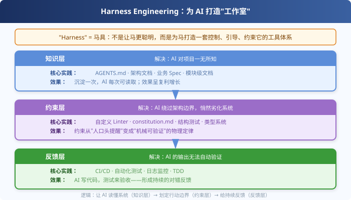

---

## 2.3 内部解法方向

基于外部实践的启发，内部的解法方向与 Harness Engineering 高度一致，落地为三条实际可操作的线：

- **知识层**：沉淀 Spec、Skill——把隐性的团队知识显性化、可复用化。一次沉淀，AI 每次都能读取，效果呈复利增长。
- **约束层**：设计宪章文件（[constitution.md](http://constitution.md/)）——把架构约束和团队规范固化为 AI 可读的规则，让约束从"人口头提醒"变成"机械可验证"。
- **反馈层**：TDD——让验证机制成为 AI 行为的即时反馈源，AI 写代码，测试来验收。


### 公司内同事实践的共同洞察：

围绕这两个挑战，公司内已经有不少同学在做深度探索。把几篇有代表性的文章放在一起看，共同结论可以用一句话概括：**解决 AI Coding 的工程问题，不是在等模型变得更聪明，而是在等工程师把"系统地图"建起来、把"约束边界"立起来、把"反馈闭环"跑起来——这，正是 2.3 内部解法方向的实战印证。**

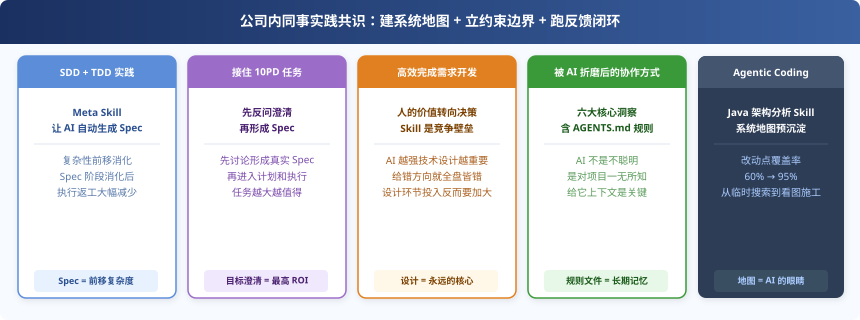

---

# 三、AI Coding 研发工作流范式演进

---

## 3.1 三代范式演进

每一代范式的出现，都是对上一代局限性的系统性回答。

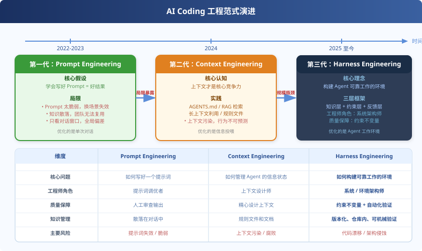

---

## 3.2 研发工作流：AI 的价值密度在哪里

AI 甜点区的共同特征：**上下文明确 + 任务结构化 + 有可参照的标准**。

远离甜点区的条件：需要隐性业务知识、需要对后果负责的判断。

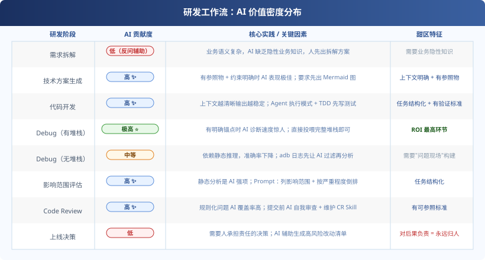

---

## 3.3 范式选型：如何组合使用

三种范式不是互斥的，应根据阶段、目的组合使用：

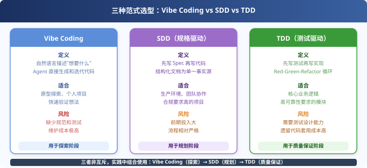

## 3.4 SDD 完整工作流

规格驱动开发的核心逻辑：**把复杂性前移消化**——Spec 阶段改十遍都没成本，代码阶段一旦固化代价极高。

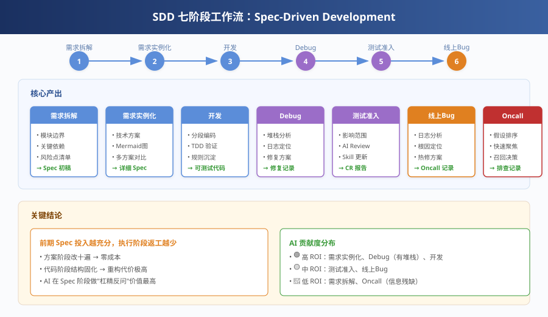

---

# 四、AI Coding 研发工作流：实战案例分享

> 以三种不同侧重点的需求开发实战，探索目前工程侧 AI 与人协同的边界、范式推进遇到的问题。


---

## 第4章结构总览：七个阶段的流水线

研发流程七个阶段形成一条完整的价值链，每个阶段的**输入、输出、AI甜点区、人的决策点**各有不同：

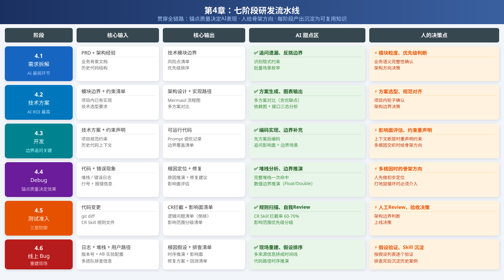

---

## 4.1 需求拆解阶段

### ① 核心判断（特征识别）

**需求拆解是整个研发链路中目前 AI 表现较弱的环节。**

**特征一：业务语义丢失。** 直播礼物业务有大量隐式的正交维度——送礼对象（主播/嘉宾）、送礼次数联动（单送/Combo）、送礼批量（单个/多个）、送礼场景（PK/秀场/游戏）。这些维度之间的约束关系、互斥规则，散落在历史代码和口口相传的业务约定里。**AI 没有这层语义，拆出来的东西自然"技术正确、业务歪斜"。**

**特征二：拆解粒度失控。** AI 拆出来的子任务，要么粒度太粗（"实现礼物面板"），要么太细（细到每行代码的逻辑判断），很少恰好是"能交给 AI 独立执行的原子粒度"。这个粒度本身，需要工程师凭架构经验判断。

**特征三：隐式上下文盲区。** 比如送礼链路需要"打折"这个业务逻辑，AI 无法自主发现，只能靠人显式投喂接口文档。

**结论**：需求拆解到技术模块，当前 AI 帮不上太多，人的架构判断不可替代。但 AI 真正能帮的，是在你有了粗略拆解后，帮你**反问和追问**——"边界合理吗""有没有遗漏的互斥场景""接口设计后续可扩展吗"。


#### 甜区与误区

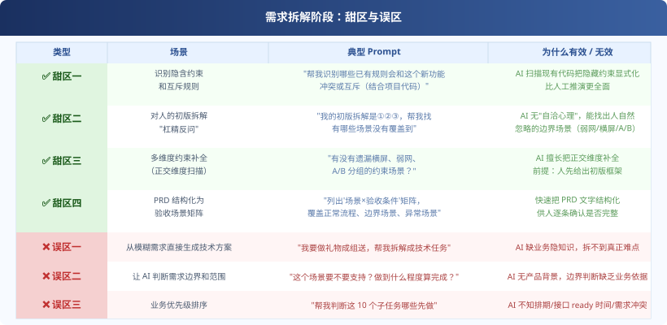


### ② 案例实战（涵盖特征场景）

#### 案例一：礼物成组送 —— 业务语义丢失导致模块缺失

> 送礼链路长，业务上下文重，整体输出效果欠佳

**现象**：PRD 只说"批量送支持特殊组数"，AI 拆解时漏掉了三个业务维度：

- 场景适配（团播、聊天室）
- 送礼人切换（主播、嘉宾）
- 礼物类型适配（普通礼物、子礼物组）

**AI 输出**：只列了"批量弹窗展示"和"送礼链路改造"，没有往下拆到 Combo 展示、埋点上报的内部改动点。

**根因分析**：业务正交维度（谁送、送给谁、在哪送）属于隐式知识，PRD 不写、AI 不知。表现正是**特征一"业务语义丢失"**。

**人工介入**：显式投喂三个维度 → AI 补齐缺失模块 → 输出完整模块拆解。


##### Prd：

[礼物贴纸-营收效率提升迭代](https://docs.corp.kuaishou.com/d/home/fcAA8AR7CklTk7xYMz8KUPyKF)

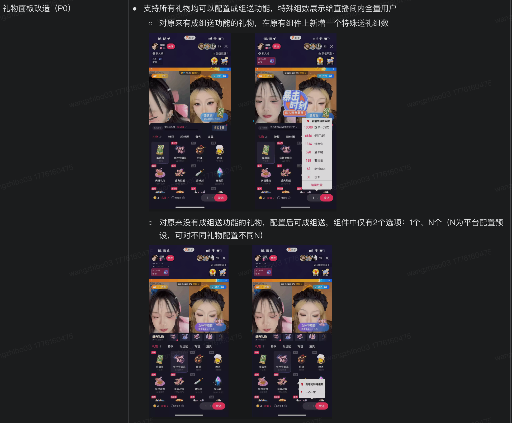

##### 模块拆解

| AI拆解需求点   | 是否准确      | 描述                                                         | 优先级 |
| -------------- | ------------- | ------------------------------------------------------------ | ------ |
| 全量礼物成组送 | ⚠️模块缺失     | 所有礼物均可配置成组送功能                                   | P0     |
| 特殊组数展示   | ⚠️逻辑分支缺失 | 原有成组送礼物新增特殊组数选项（如25个）<br/>缺失部分：1.全部送礼场景未适配 2.特殊组的数字与原有组数冲突情况 | P0     |
| 新礼物成组送   | ✅             | 原无成组送功能礼物可配置后显示：1个、N个                     | P0     |
| 顶部新增样式   | ✅             | 批量送列表顶部新增一栏特殊组数样式                           | P0     |
| 送礼链路改造   | ⚠️模块缺失     | 特殊组合需要打折                                             | P0     |
| 业务场景适配   | ⚠️模块缺失     | 场景(团播、聊天室)，送礼人切换(主播、嘉宾)，礼物类型(普通礼物、子礼物组) | P0     |


##### 甜区与误区

| AI做的好的                                                   | AI做的不好的                                                 |
| ------------------------------------------------------------ | ------------------------------------------------------------ |
| [技术方案](https://docs.corp.kuaishou.com/k/home/VTEMcELsut1g/fcAC-Ph0eHddgcyKZsDlKeiD5)<br/>1. 【梳理能力强】完成批量送面板上下游代码梳理<br/>2. 【逻辑推理强】基本上可以把没有业务上下文相关的部分列出来 | 1. 【业务语义丢失】没有考虑场景(团播、聊天室)，送礼人切换(主播、嘉宾)，礼物类型(普通礼物、子礼物组)等隐藏业务上下文的情况 <br/> 2. 【拆解粒度失控】输出技术方案过于简单，直接跳到改动点，缺乏对子模块/数据流的深度拆解（如礼物成组送的"批量弹窗→送礼链路→Combo展示→埋点"四个子模块各自的内部改动点，AI 只列了第一层，没有往下拆）<br/> 3.【架构上下文缺失】没有接口文档情况下，难以覆盖到送礼链路需要改造的一些业务架构上下文 |


##### prompt记录

```
深度思考，token拉爆，拆解技术模块，输出模块拆解_new.md

这是需求的prd: https://docs.corp.kuaishou.com/d/home/fcABwdx-vFSq7uKeWv2bOTZWC。主要是 礼物面板改造部分
接口文档：https://docs.corp.kuaishou.com/k/home/VeXO1Rnp9R9E/fcACN4ZuVGB2A0Wduc1ztBHIu?ro=false
设计稿：批量送的列表顶部新增一栏样式
```


#### 案例二：多人连线迁移简易直播间 —— 拆解粒度失控与依赖链盲区

**现象**：AI 拆解时把"迁移 LiveAudienceMultiLinePresenterV2"作为单一任务，没有进一步拆到 Service 注册、Provider 路径更新、接口三态分析（可实现/Stub/noop）。

**AI 输出**：直接跳到改动点列表，粒度太细（细到每个方法），缺乏对子模块/数据流的深度拆解。

**根因分析**：这正是**特征二"拆解粒度失控"**——AI 要么太粗要么太细，很少恰好停在"能独立执行的原子粒度"。

**人工介入**：

1. 人先给出骨架方向：按"依赖链梳理 → 范式对标 → 接口三态分析"三步推进
2. AI 在骨架内执行批量分析（39 个接口方法三态分类）
3. 人审核分类，确认关键接口实现策略

**价值**：纯人工完成需 2-3 天；AI 辅助后压缩到半天。核心收益在于"批量分析"——AI 能一次性处理 39 个接口，不会遗漏，也不会疲劳。


##### prd：

##### [ 简易直播间外显多人PK血条分数](https://docs.corp.kuaishou.com/d/home/fcACYHYGuR4xFqylZbOlie1S_)

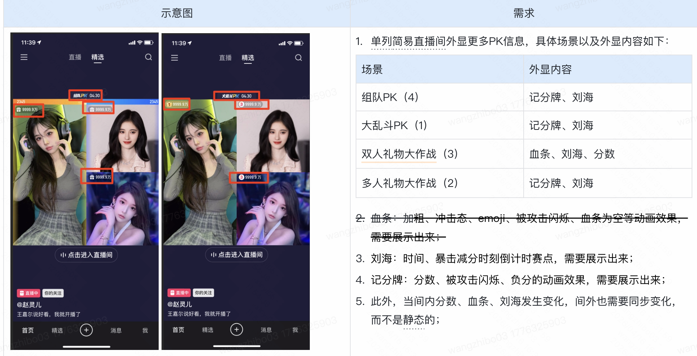


##### 模块拆解

[ 简易直播间外显多人PK血条分数 - 技术模块拆解](https://docs.corp.kuaishou.com/d/home/fcAC0CrEMYpj9fZd-o0qoOofm)

| AI拆解需求点 | 是否准确 | 描述 | 优先级 |
| ------------ | -------- | ---- | ------ |
| 场景矩阵识别（组队PK/大乱斗/双人礼物大作战/多人礼物大作战）| ✅ | 4种场景对应 BizType 和外显组件分析准确 | P0 |
| 双轨数据链路设计（5s HTTP轮询→长连接切换）| ✅ | HTTP兜底 + SC信令接管的双轨架构设计正确，切换阈值5s符合实际 | P0 |
| LiveMultiInteractManager 完整实例化 | ✅ | 识别到不应 mock/stub，需引入真实 Manager 复用 RTC/BizAdapter 能力 | P0 |
| giftBattleSignal 字段新增（服务端协同）| ⚠️ 遗漏细节 | 识别到字段需求，但未主动发现需要服务端在两个接口（liveMultiRtcInfo + liveFeed/info）同时扩展 | P0 |
| 礼物大作战 ViewController 硬编码间内判断 | ❌ 遗漏 | 未识别 LiveAudienceMultiLineGiftBattleDuetSceneViewController 内部可能有间内硬编码（如评论区高度、挂件显隐），需逐类检查裁剪 | P1 |
| disableAnimation() 硬编码 true 问题 | ❌ 遗漏 | 未主动发现 LivePreviewMultiPkUtils.kt 中动画被硬编码关闭，需改为 KSwitch 动态控制 | P1 |


##### 甜区与误区

| AI做的好的  | AI做的不好的                   |
| ----------- | ------------------------------ |
| 1. 【依赖链梳理强】能读取 `LiveAudienceMultiLinePresenterV2` 的完整依赖图，自动列出 Service 注册情况<br/>2. 【范式对标准确】对标 `LivePreviewMultiPkPresenter` 的插件化实现，差异点和风险点分析准确<br/>3. 【接口分析完整】对 39 个接口方法做三态分析（可实现/Stub/noop），自动化率高 | 1. 【业务语义丢失】无法自主判断简易直播间哪些 Service 必须真实实现、哪些 noop 合理，需要人工决策<br/>2. 【跨模块影响盲区】改动后对上下游模块（LiveStage、互动框架）的实际影响，AI 无法主动评估<br/>3. 【历史债务感知差】简易直播间遗留的"半插件化"状态，AI 识别不出，可能给出在原有架构上打补丁的建议 |


##### prompt记录

```
深度思考，token拉爆，读需求mprd，拆解技术模块，输出模块拆解_new.md。有啥不懂的及时询问我

这是需求的prd: https://docs.corp.kuaishou.com/d/home/fcACYHYGuR4xFqylZbOlie1S_
```


### ③ 实践小结（特征提炼）

基于两个案例，提炼出需求拆解阶段的三条核心经验：

| 特征 | 提炼的经验 | 对应案例 |
|------|-----------|---------|
| **业务语义丢失** | AI 无法补全隐式上下文，需要人显式投喂业务正交维度（谁送、送给谁、送多少、在哪送） | 案例一：送礼场景/送礼人/礼物类型三个维度缺失 |
| **拆解粒度失控** | 发现 AI 粒度偏了后及时纠正——人先给骨架方向，AI 在骨架内执行批量分析 | 案例二：39 个接口方法三态分析 |
| **隐式上下文盲区** | 接口文档需显式投喂，AI 无法自主发现"打折"等业务逻辑 | 案例一：送礼链路打折逻辑遗漏 |

**关键洞察**：需求拆解的本质是把"人脑中的业务地图"显性化为"AI 可理解的结构化上下文"。这步做不好，后续阶段再怎么优化都是"垃圾进、垃圾出"。


### ④ 行业方案对比

| 来源 | 核心思路 | 关键机制 | 适用场景 |
|------|---------|---------|---------|
| **Superpowers 框架** | AI 动手前强制进入提问循环 | "苏格拉底式提问"：真正想解决什么？成功标准是什么？ | IDE 侧个人使用；防止 AI 直接跳入执行 |
| **淘宝** | 分层知识库让 AI 有"系统地图" | 基础技术层→业务层→团队规范层→代码仓库层 | 有稳定业务 Spec 积累的团队 |
| **字节 MarsCode** | 推理模型与生成模型分离 | 推理更强的模型（DeepSeek R1）负责规划，代码生成更强的模型（Claude 3.5）负责执行 | 企业级平台；个人则：复杂拆解选 o3/R1，执行选 Claude 3.x |

**共同洞察**：三种思路底层逻辑一致——需求拆解的瓶颈不是 AI 执行能力，而是**目标传达复杂度**。解法都是让"任务意图"在进入代码生成前被充分澄清和结构化。

**快手直播团队对应实践**：人工草稿拆解 + AI 追问确认的"四步法"（见 ⑤范式沉淀），是 Superpowers 思路的轻量化落地——不需要引入专用推理模型，通过 Prompt 工程实现目标澄清前置。


### ⑤ 范式沉淀：人工草稿 + AI追问的四步法

**核心原则**：
- **原则：拆解是人的事，反问是 AI 的事。** 人先出粗略拆解，AI 用"杠精"视角挑毛病。
- **原则：先讨论，再执行。** 拆解阶段产出：模块边界 + 关键依赖关系 + 主要风险点，三件事确认清楚再动手。
- **原则：业务维度必须显式化。** 把业务正交维度（谁送、送给谁、送多少、在哪送）整理清楚作为上下文投喂 AI，效果好很多。

**四步法流程**：

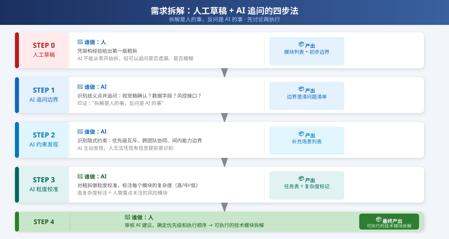

| STEP | 谁做 | 做什么 | 产出 |
|------|------|--------|------|
| STEP 0：人工草稿拆解 | 人 | 凭架构经验给出第一版粗拆 | 模块列表 + 初步边界 |
| STEP 1：AI追问边界确认 | AI | 识别歧义点并追问 | 边界澄清问题清单 |
| STEP 2：AI追问场景约束发现 | AI | 识别可能的隐式约束 | 补充场景列表 |
| STEP 3：AI粒度校准 | AI | 对粗拆做粒度校准，标注复杂度 | 最终任务表 + 复杂度标记 |
| STEP 4：人工决策最终任务表 | 人 | 审核AI建议，确定优先级和执行顺序 | 可执行的技术模块拆解 |


### ⑥ 范式案例（按四步法步骤证明范式）

#### 案例：简易直播间礼物贴纸外显 —— 四步法全流程还原

> 需求明确、业务上下文较轻，适合作为四步法的完整示例

---

**STEP 0：人工草稿拆解（粗分）**

开发者先凭经验给出第一版粗拆，这是不可省的——AI 不能从零开始拆，但可以帮你追问是否遗漏、是否模糊。

```
我的粗拆草稿：
1. 贴纸容器在简易直播间左上角展示，固定位置不随滚动
2. 展开态展示 7.5 个 item，超过不轮播；折叠态在连屏/横屏开播间缩小右下角
3. 点击贴纸进间后拉起礼物贴纸面板，定位到对应才艺
4. 需要处理与其他左上角组件（节目单、团播）的优先级互斥
```

---

**STEP 1：AI追问 — 边界确认**

将粗拆草稿交给 AI，AI 识别歧义点并发起追问：

```
AI 输出：
1. **视觉稿确认**：能否提供本地截图或更详细描述"展开态/折叠态"的视觉差异？
2. **数据字段确认**：礼物贴纸数据在哪个接口返回？字段名是什么？（例如 mLiveGiftStickerInfo）
3. **风控接口范围**：需要和风控对接的具体参数列表是什么？超时/失败降级策略是什么？
4. **进间联动可行性**：完整直播间的礼物贴纸面板是否支持"定位到指定才艺"的 API？
```

**范式验证**：这步印证了"拆解是人的事，反问是 AI 的事"——人给粗略方向，AI 用杠精视角挑出模糊点。

---

**STEP 2：AI追问 — 场景约束发现**

AI 进一步识别可能的隐式约束：

```
AI 输出：
5. **优先级协调**：节目单、团播组件、礼物贴纸三者互斥规则是什么？是否需要我先调研现有左上角组件的布局实现？
6. **间内面板定位 API 设计**：需要确认礼物贴纸面板的当前实现类，评估定位能力开发量
7. **风控对接准备**：周四前准备贴纸名称列表样例，方便与风控团队讨论接口设计
```

**范式验证**：AI 主动发现了三个隐式约束（优先级互斥、间内面板能力、风控接口协同），这正是"AI 帮你追问遗漏"的价值。

---

**STEP 3：AI粒度校准**

基于澄清后的完整信息，由 AI 对粗拆草稿做粒度校准，并标注复杂度：

```
AI 输出最终模块拆解：
| 模块 | 复杂度 | 关键约束 |
|------|--------|---------|
| 展开态展示 | 中 | 7.5个贴纸，超过不轮播，不支持滑动，仅支持点击 |
| 折叠态展示 | 低 | 连屏/横屏开播间缩小在右下角；简易直播间不展示 |
| 位置固定 | 低 | 左上方，固定位置，不跟随滚动 |
| 优先级管理 | 高 | 节目单 > 团播组件 > 礼物贴纸 |
| 进间联动 | 高 | 进间后拉起礼物贴纸面板 + 定位至对应才艺 |
| 风控接入 | 中 | 过风控接口，敏感词贴纸过滤，其余正常展示 |
```

**范式验证**：AI 把"进间联动"和"优先级管理"标记为高复杂度，这两个正是人工粗拆时粒度偏粗、容易被跳过的部分。

---

**STEP 4：人工决策最终任务表**

开发者审核 AI 的拆分建议，做最终决策——优先级、顺序、合并还是人来判断。

```
我的最终决策：
1. 先做"位置固定 + 展开态展示"（基础能力，低风险）
2. 再做"优先级管理"（涉及多组件互斥，需要协调）
3. 然后做"风控接入"（可并行）
4. 最后做"进间联动"（依赖间内面板 API，需跨团队协同）
```

**范式验证**：AI 无法判断优先级和执行顺序，这部分必须由人来决策。四步法保证了"目标传达充分"而不是"AI 替人决策"。

---

**本案例的范式完整性验证**

| 四步法步骤 | 本案例体现 | 范式验证 |
|-----------|-----------|---------|
| STEP 0 人工草稿 | 开发者给出四点粗拆 | 人给骨架方向 |
| STEP 1 边界确认 | AI 追问视觉稿、数据字段、风控接口 | AI 挑模糊点 |
| STEP 2 场景约束发现 | AI 补充优先级互斥、间内面板能力、风控协同 | AI 追问遗漏 |
| STEP 3 粒度校准 | AI 标注复杂度，高亮"进间联动""优先级管理" | AI 批量分析 |
| STEP 4 人工决策 | 开发者确定执行顺序和优先级 | 人做最终决策 |

**关键数字**：从 PRD 到最终模块拆解约 2 小时；如果纯人工拆解需要 0.5 天。核心收益在于 AI 主动追问的 7 个问题，避免了后续开发阶段的返工。


## 4.2 技术方案阶段

### ① 核心判断（特征识别）

**这是目前 AI 贡献比例最高、ROI 最高的阶段。**

**特征一：隐性质量陷阱。** AI 产出的方案"看起来很完整"，但背后可能有大量实现细节偏差——技术实现路径是对的，但"这个方案在项目内是否有更合适的实现模式""关键设计决策是否符合实际约束"，AI 往往给不出最优答案。

**特征二：不熟悉技术栈时的验收难题。** 礼物贴纸用 KRN（React Native），开发者对这个栈熟悉程度有限，AI 给出的方案技术上可行，但不知道"是不是最优解"，也不知道"项目内是否有更合适的已有实现"。

**特征三：边界条件在压力下容易遗漏。** AI 会考虑主要路径和常见降级，但"高度变 0 闪白""Map 容量爆炸""签名懒刷新"等细粒度边界，往往需要人显式追问。

**结论**：方案生成是 AI 甜点区，但验收需要人主动追问"项目内是否有轮""边界情况会怎样"。


### ② 案例实战（涵盖特征场景）：礼物贴纸 KRN 实现

#### 背景

礼物贴纸需要在简易直播间外显才艺列表（展示 7.5 个 item，无限轮播，手动打断后自动恢复）。技术栈选型 KRN（React Native），开发者对 RN 熟悉度中等，对项目内 KRN 规范和已有轮子了解有限。

采用"五步方案法"推进：需求 → 梳理现有实现 → 出技术方案 → 确认 → 编码。

---

#### 关键差异：AI 方案 vs 最终落地

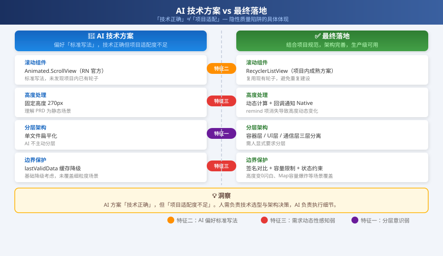

**洞察**：AI 方案"技术正确"，但"项目适配度不足"。这正是**特征一"隐性质量陷阱"**的具体体现。


#### 关键洞察与经验

| 洞察点 | 具体表现 | 对应策略 |
|--------|----------|----------|
| **AI 偏好"标准写法"** | 推荐 `Animated.ScrollView`（RN 官方），未发现项目内 `RecyclerListView` 成熟方案 | 方案确认阶段，主动追问："项目内是否有类似滚动列表的已有实现？"让 AI 搜索 `RecyclerListView` 相关代码 |
| **需求隐藏的动态性** | PRD 说"展示 7.5 个 item"，AI 理解为固定高度；实际 remind 项定时消失导致高度动态变化 | PRD 阶段就追问："remind 项消失后，列表高度会变吗？"前置澄清动态约束 |
| **项目内工具函数优先原则** | AI 推荐社区标准库（`fast-image`），实际项目有 `@kds/image` 统一封装 | 方案确认时明确约束："优先使用项目内 `@kds/*` 系列组件，找不到再用社区库" |
| **边界条件在压力下容易遗漏** | AI 考虑了降级，但未覆盖"高度变 0 闪白""Map 容量爆炸"等细粒度边界 | 编码后追问："这个实现可能引入什么新的问题？还需要检查哪些边界？" |
| **架构分层 AI 不会主动做** | AI 倾向单文件完成功能，实际需要容器/组件/通信分层 | 方案阶段明确要求："按容器组件、UI 组件、事件通信三层拆分，画出组件层级图" |


#### 甜区与误区

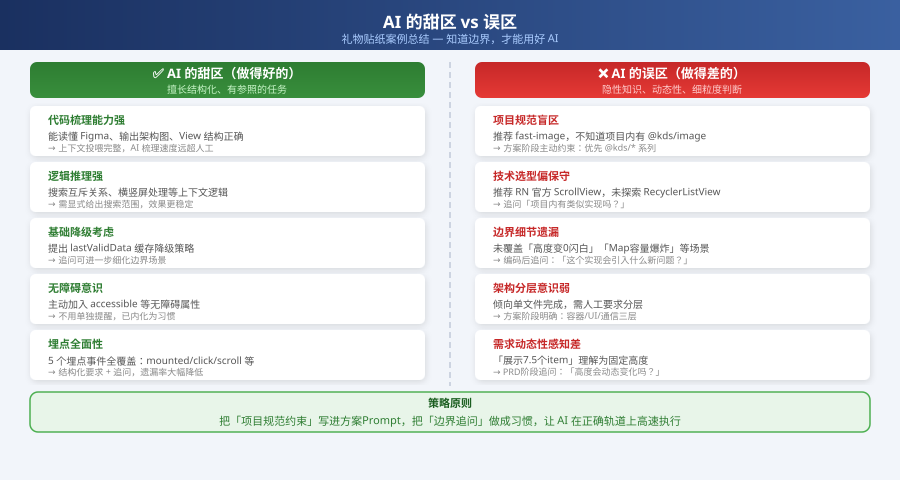

#### 验收策略：如何在陌生技术栈下验收 AI 方案

| 验收维度 | 具体操作 | 工具/方法 |
|---------|---------|----------|
| **逻辑正确性** | 要求 AI 先用 Mermaid 输出流程图/时序图，确认逻辑正确再看代码 | `先画出数据流图和事件流图，再生成代码` |
| **项目规范对齐** | 明确约束："优先参考项目内已有实现模式" | `搜索项目内是否有类似滚动列表实现，列出文件路径` |
| **已有轮子复用** | 追问："项目内是否有 X 功能的封装？" | `搜索 @kds/* 系列组件，找出图片加载/事件总线的已有方案` |
| **边界健壮性** | 追问："边界情况会怎样？这个实现可能引入什么新问题？" | `列出高度计算/数据更新/点击防抖的边界场景，并给出处理方案` |
| **性能可靠性** | 分维度追问:"渲染性能/事件性能/内存管理还有哪些优化点？" | `从渲染、事件、内存三个维度，列出性能优化清单` |
| **需求隐藏动态性** | PRD 阶段就追问："X 功能在什么场景下会动态变化？" | `remind 项消失后，列表高度会变吗？需要通知 Native 吗？` |
| **架构分层要求** | 方案阶段明确要求："按职责分层，画出组件层级图" | `拆解为容器组件(数据)、UI组件(渲染)、通信层(Native事件)三层` |


### ③ 实践小结（特征提炼）

基于礼物贴纸案例，提炼技术方案阶段的三条核心经验：

| 特征 | 提炼的经验 | 对应案例表现 |
|------|-----------|-------------|
| **隐性质量陷阱** | 追问"项目内是否有轮"，不要让 AI 默认用"标准写法" | AI 推荐 ScrollView，追问后发现项目内 RecyclerListView 更优 |
| **验收难题** | 用 Mermaid 图先确认逻辑，不要第一步就看代码 | 数据流图、事件流图让问题一目了然 |
| **边界遗漏** | 显式追问"边界情况会怎样""可能引入什么新问题" | 高度变 0 闪白、Map 容量爆炸等边界都是追问后补充 |

**关键洞察**：方案阶段的本质是把"项目内的隐性规范"显性化为"AI 可理解的上下文"。追问越主动，后续开发返工越少。


### ④ 行业方案对比

| 来源 | 核心思路 | 关键机制 | 适用场景 |
|------|---------|---------|---------|
| **Cursor Composer** | 先出 Spec/方案文档，再进入编码 | `.cursorrules` + `spec.md` 驱动；让 AI 先梳理现有实现再生成新方案 | 个人开发者；中等规模存量代码 |
| **字节 MarsCode** | 推理模型做方案，生成模型写代码 | DeepSeek R1 负责规划，Claude 3.5 负责执行；推理分离 | 企业级平台；方案复杂度高的场景 |
| **Copilot + PR 草稿** | 方案 → PR 描述 → 代码三段式 | 先在 Issue 里讨论方案，Copilot 根据 PR 描述生成代码 | 团队协作；方案需多人确认的场景 |

**共同洞察**：三种方案底层逻辑一致——**"推理分离"**：让方案规划在代码生成之前完成，避免 AI 一边猜方案一边写代码。

**快手直播团队对应实践**：五步方案法（需求 → 梳理现有实现 → 出技术方案 → 确认 → 编码）是 Cursor/MarsCode 思路的轻量化落地——不需要引入专用推理模型，通过 Prompt 工程实现方案质量前置。


### ⑤ 范式沉淀：五步方案法

**核心原则**：
- **原则：项目内轮子优先。** 方案确认阶段主动追问："项目内是否有类似X的已有实现？"
- **原则：架构分层显式要求。** 明确要求："按职责分层，画出组件层级图"，不能依赖 AI 自发分层。
- **原则：Mermaid 图先行。** 先用图确认逻辑正确再看代码——图比代码更容易看出问题。
- **原则：边界场景前置追问。** 追问"X 功能在什么场景下会动态变化？""这个实现可能引入什么新问题？"

**五步法流程**：

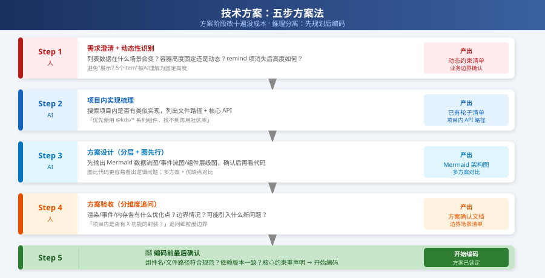

| Step | 谁做 | 做什么 | Prompt 要点 |
|------|------|--------|------------|
| Step 1 | 人 | 需求澄清 + 动态性识别 | "列表数据在什么场景会变？容器高度固定还是动态？" |
| Step 2 | AI | 项目内实现梳理 | "搜索项目内是否有类似实现，列出文件路径 + 核心 API" |
| Step 3 | AI | 方案设计（分层 + 图先行） | "先输出 Mermaid 数据流图/事件流图/组件层级图" |
| Step 4 | 人 | 方案验收（分维度追问） | "渲染/事件/内存各有什么优化点？边界情况会怎样？" |
| Step 5 | 人 | 编码前最后确认 | "组件名、文件路径是否符合规范？依赖版本是否一致？" |


### ⑥ 范式案例

#### 案例一、礼物支持特殊组数批量送礼

[ AI Coding实践案例分享-用 CodeFlicker 生成技术方案并落地](https://docs.corp.kuaishou.com/k/home/VaEvME9bZFMQ/fcADsmcJor4me0kFAJNH3clqb)


##### **AI使用姿势：**

定义好入口、出口、处理逻辑，中间链路的技术方案设计交给AI(给出需要处理的技术重点)

> 有一定的局限性，更适用于数据流复杂但明确输入、输出的场景

| **模块1：批处理弹窗支持特殊组数**                            | **模块2：送礼链路改造(通知服务端本次送礼来自于特殊组别)**    |
| ------------------------------------------------------------ | ------------------------------------------------------------ |
| 礼物成组送打赏优化，支持 gift/panel 接口下发的动态批量配置：<br/>1.**【数据入口】数据：**gift/panel 接口中获取 specialBatchSend 字段，非空才进入逻辑** <br/>2.【出口】**渲染位置：**批处理弹窗**<br/>3.【处理逻辑】**：<br/>如果 allUseSpecialBatchSend 为 true，返回结果使用 specialBatchSend 字段如果为 false，merge 列表后修改返回值，相同的 mGiftBatchCount 使用 specialBatchSend 字段的 | 1.【数据入口】交互：送礼按钮点击<br/>2. 【出口】位置：gift/sendV2接口<br/>3. 【处理逻辑】：判断为特殊送礼组数，在接口sendExtraInfo字段中新增investBatchSend为true特殊送礼组数判断条件：gift/panel接口 specialBatchSend 字段非空 |


##### 提示词&效果

```
// 提示词模版

// 📍 第一层：Context（上下文）- 定位代码位置，建立AI的空间感
[引入关键代码位置]你是一个客户端开发专家

// 🎯 第二层：Task（任务）- 明确输入输出
新增逻辑：xxx需求(功能描述)，要求
1. 【输入/输出，告诉AI从哪里到哪里，收敛上下文】
1. 【处理逻辑，告诉AI怎么处理】

出几个技术方案并列出各个方案具体的流程图、类图、架构图，各自优缺点，生成md文件。要求：带新增修改点。若修改点的标注导致精度过细，可以先出一个原始图，再出一个修改后的图

// 🔒 第三层：Constraint（约束）- 把复杂问题留给AI
需要重视的点：xxxx 【中间链路重点需要关心啥，把捋复杂逻辑的舒适区交给AI】
```


#####  中间过程记录：模块1-批处理弹窗支持特殊组数

| 阶段         | 提示词                                                       | 产物                                                         | 中间过程                                                     |
| ------------ | ------------------------------------------------------------ | ------------------------------------------------------------ | ------------------------------------------------------------ |
| 技术选型     | `// 📍 第一层：Context（上下文）- 定位代码位置，建立AI的空间感 LiveGiftBottomBarConfig.kt:200-202 你是一个客户端开发专家 // 🎯 第二层：Task（任务）- 明确输入输出 新增逻辑：礼物成组送打赏优化(选择送礼)，要求 1. gift/panel接口中获取specialBatchSend字段，非空才进入逻辑 【入口】 2. 如果allUseSpecialBatchSend为true，返回结果使用specialBatchSend字段；如果为false，merge列表后修改返回值，相同的mGiftBatchCount，使用specialBatchSend字段的 【出口】【处理逻辑】 // 🔒 第三层：Constraint（约束）- 把复杂问题留给AI 你需要着重考虑在这个位置如何获取到gift/panel的specialBatchSend字段。【中间链路注意点】 出几个技术方案并列出各自优缺点，生成md文件。要求：补充各个方案具体的流程图、类图、架构图(带新增修改点，若修改点的标注导致精度过细，可以先出一个原始图，再出一个修改后的图)` |  | AI补充遗漏细节(搜索面板)： |
| 详细技术方案 | `采用方案1，标准核心代码改动。带架构图、流程图、类图。若修改点的标注导致精度过细，可以先出一个原始图，再出一个修改后的图` | [AI Coding实践案例分享-礼物成组送功能(100%AI贡献)](https://docs.corp.kuaishou.com/k/home/VaEvME9bZFMQ/fcADsmcJor4me0kFAJNH3clqb#section=h.1a5vdxoqmdp4) |  |


##### 本案例的范式完整性验证

| 五步法步骤 | 本案例体现 | 范式验证 |
|-----------|-----------|---------|
| Step 1 需求澄清 + 动态性识别 | 明确"特殊组数送礼"的入口（gift/panel 接口 specialBatchSend 字段）、出口（批处理弹窗渲染 + gift/sendV2 接口）、处理逻辑（allUseSpecialBatchSend 判断分支） | 人给骨架方向：入口/出口/处理逻辑三层约束 |
| Step 2 项目内实现梳理 | AI 搜索送礼链路相关代码 | AI 主动发现上下文盲区 |
| Step 3 方案设计（分层 + 图先行） | AI 输出多个技术方案，每个方案包含流程图、类图、架构图（带新增修改点） | 图先行：架构图/流程图比代码更容易看出问题 |
| Step 4 方案验收（分维度追问） | 人选择方案1，要求"标准核心代码改动"，AI 补充完整架构图和流程图 | 人做最终决策：选择方案并确认修改范围 |
| Step 5 编码前最后确认 | 方案评审通过后进入编码阶段 | 方案阶段结束，进入执行 |

**关键数字**：纯人工完成技术方案约需 2-3 小时；AI 辅助后约 30 分钟。核心收益在于 AI 一次性输出多个方案的对比，且每个方案都包含完整的图。


#### 案例二、连线迁移简易直播间

[互动框架迁移到简易直播间 — 方案评审](https://docs.corp.kuaishou.com/k/home/VCudcB_pc8FU/fcABNydEoa2g0-NM1PooaeNj6)

**AI使用姿势：** 技术决策极其复杂——不同插件层级、模块间依赖图、Service 注册时机全部摞在一起。没有让 AI 帮"拆解任务"，而是让 AI 做三件事：梳理依赖链 + 对标已有范式 + 依赖可行性三态分析。

| **价值点** | **AI 做了什么** | **人做了什么** |
|-----------|----------------|--------------|
| 梳理依赖链 | 读取 `LiveAudienceMultiLinePresenterV2` 的完整依赖图，自动列出 Service 注册情况 | 判断哪些 Service 必须真实实现、哪些 noop 合理 |
| 对标已有范式 | 对比 `LivePreviewMultiPkPresenter` 的插件化实现，列出 MultiLine 与 MultiPk 的关键差异 | 确认对标方案，验收差异点是否合理 |
| 接口三态分析 | 分析 39 个接口方法，给出可实现/Stub/noop 三态分类 | 审核分类判断，确认关键接口的实现策略 |


##### 本案例的范式完整性验证

| 五步法步骤 | 本案例体现 | 范式验证 |
|-----------|-----------|---------|
| Step 1 需求澄清 + 动态性识别 | 明确"互动框架迁移到简易直播间"的核心约束：插件层级、模块依赖、Service 注册时机 | 人给骨架方向：迁移范围 + 核心约束清单 |
| Step 2 项目内实现梳理 | AI 读取 `LiveAudienceMultiLinePresenterV2` 完整依赖图，自动列出 Service 注册情况；对比 `LivePreviewMultiPkPresenter` 已有实现 | AI 批量梳理：39 个接口 + 对标方案差异 |
| Step 3 方案设计（分层 + 图先行） | AI 输出依赖链梳理结果 + 对标差异分析 + 接口三态分类（可实现/Stub/noop） | 图先行：依赖图 + 差异对比表比代码更容易看出问题 |
| Step 4 方案验收（分维度追问） | 人判断哪些 Service 必须真实实现、哪些 noop 合理；审核三态分类，确认关键接口实现策略 | 人做最终决策：验收 AI 的分类判断 |
| Step 5 编码前最后确认 | 方案评审通过，进入迁移编码阶段 | 方案阶段结束，进入执行 |

**关键数字**：纯人工完成上述分析需要 2-3 天；AI 辅助后压缩到半天。核心收益在于"批量分析"——AI 能一次性处理 39 个接口，不会遗漏，也不会疲劳。


## 4.3 开发阶段

### ① 核心判断

**开发阶段的核心挑战是两个：AI 偷懒 + 上下文断层。**

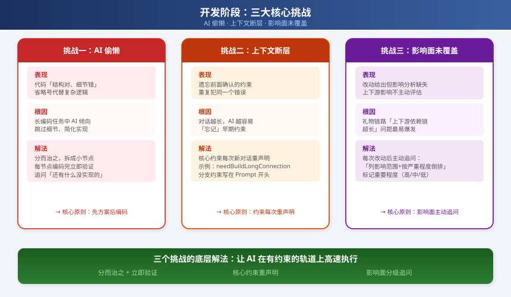


### ② 案例实战

开发阶段的三个代表性案例，覆盖三种典型编码场景：

| 案例 | 场景特征 | 核心问题 | 解法 |
|------|---------|---------|------|
| **案例一：礼物贴纸 KRN 无限滚动** | 新技术栈 + 视觉逻辑 | AI 方案技术可行，但边界遗漏（视图未渲染时宽度计算为0、最大宽度缓存不更新） | 追问两个边界问题，AI 给出修复方案；整体贡献度高 |
| **案例二：成组送礼（业务上下文重）** | 多模块横跨，业务规则复杂 | AI 拆解粒度偏浅（只到第一层），子模块内部改动点遗漏；影响面（Combo展示/埋点上报）未主动评估 | 分而治之 + 链路分段验证；每模块编码完成后立即追问影响面 |
| **案例三：连线迁移（影响面广）** | 架构改造，上下游依赖复杂 | 上下文断层：随对话变长，AI 遗忘了 `needBuildLongConnection` 分支约束，把 Presenter 加载放到了分支外 | 核心约束在每次新对话时重新声明；多根因问题人先给骨架方向 |


### ③ 实践小结

1. **"先方案后编码"是最有价值的习惯**：方案阶段改十遍没成本，代码阶段结构固化后重构代价极高
2. **影响面主动追问**：不要等 AI 主动说，每次改动后都要追问影响范围，并要求按严重程度倒排
3. **UI 和逻辑分开做**：两者混在一起容易互相干扰 AI 的注意力，导致逻辑错误被 UI 正确掩盖
4. **上下文断层是最隐蔽的问题**：对话越长越容易出现，建议核心约束在每次新对话时重新明确声明
5. **项目内工具函数优先**：先查再造，避免重复轮子的同时也避免引入不符合项目规范的第三方写法


### ④ 行业对比

#### 1）TDD范式

OpenAI Harness 实践的关键洞察：**"每当 Agent 犯了一个错误，就花时间工程化一个解决方案，确保 Agent 再也不会犯同样的错误。"**

具体落地：把常见错误模式编码成 Linter 规则或 AGENTS.md 约束，让工程约束成为 AI 行动边界的"物理定律"。对于团队，对应到 Skill 沉淀——把每次纠正 AI 错误的经验沉淀成可复用的 Skill 文件。

**美团 TDD 三策略：**

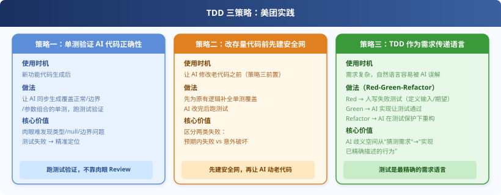

> **局限性**：这套方案要求代码有良好的可测试性（接口隔离、依赖注入）；遗留代码或强 UI 耦合场景（如 Android View 层）套用成本较高，更适合纯逻辑层（Service / ViewModel / Presenter 中的业务逻辑）。


#### 2）SDD范式

**核心定义**：SDD（Specification-Driven Development，规范驱动开发）将结构化的规范文档作为开发的"唯一真理源"（Single Source of Truth），AI 根据规范生成代码，人负责编写规范、审阅与监督。

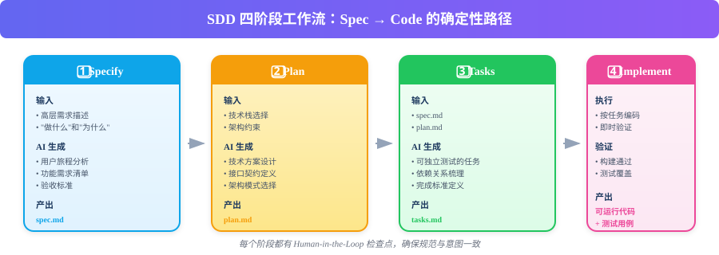


**规范文件体系**：三层约束结构，从全局架构到编码细节逐层细化。

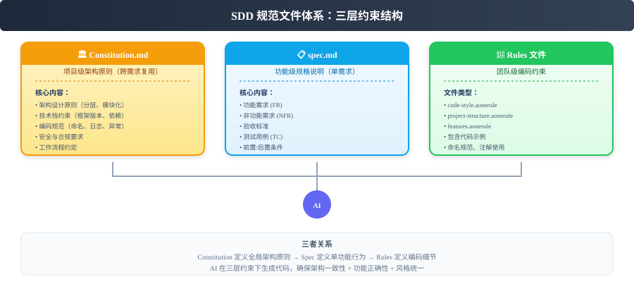


**constitution.md 示例**：固化项目级架构原则，成为后续 AI 编码的约束边界。

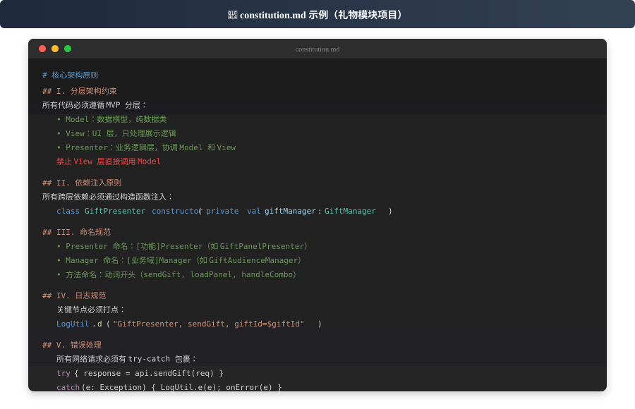

**为什么这三个项目没用 SDD？**

| 项目 | 未使用 SDD 原因 | SDD 成本判断 |
|------|----------------|--------------|
| 礼物贴纸 | 新技术栈 KRN 探索，快速验证优先 | 前期规范编写成本 > 收益 |
| 成组送 | 存量代码迭代，业务上下文重 | 难以从零建立规范体系 |
| 连线迁移 | 迁移类项目，依赖原有架构决策 | 规范约束价值有限 |

**适用场景判断**：

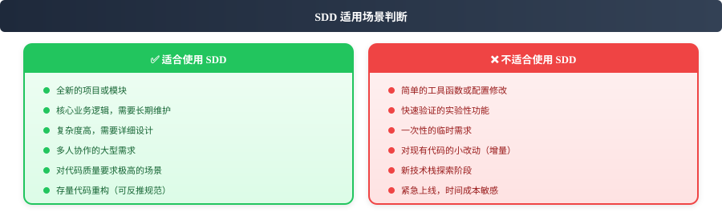

**行业工具对比**：

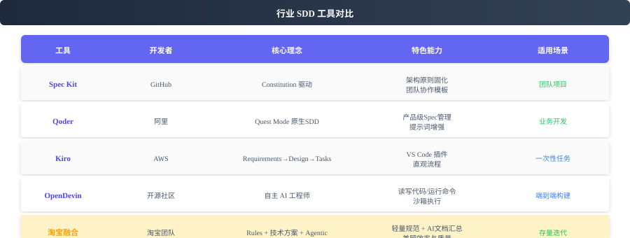

**淘宝融合策略**（最佳实践）：轻量技术方案模板 + Rules 严格约束 + Agentic Coding 高效实现 + AI 自动汇总架构文档。在存量代码迭代场景下，比纯 SDD 更务实。

> **局限性**：SDD 要求前期投入规范编写时间（简单需求可能写规范 > 直接编码），且工具链尚不成熟——同份规范不同时间生成代码质量差异大，增量更新困难，容易丢失手工修改部分。


### ⑤ 范式沉淀

**原则：编码 Prompt 的标准结构**

```
我想要实现 xx 功能/技术点，关键点：
1. 功能/技术关键点
2. 功能/技术关键点
先出一个方案，我确认后再编码（不要直接写代码）
```

这句"先出方案，我确认后再编码"救过很多次工作——方案阶段改十遍都没成本，代码阶段结构一旦固化，重构代价极高。

- **原则：对 AI "压榨极限"。** 主动追问："这个实现可能引入其他新的问题吗？""你觉得还有什么边界没处理？"AI 没有人类的自洽心理，追问往往能暴露出它自己也知道但没主动说的风险点。
- **原则：影响面主动评估。** 每次改动后：`列一下本次改动的影响范围，标记出每条的重要程度（按严重程度倒排）`。加上"标记重要程度"后效果好很多。
- **原则：工具函数查项目内。** `我想要做一个 2s 防止点击的功能，查询下项目内有哪些方法可以使用`——先查项目内实现，再考虑新造，避免重复轮子。
- **原则：UI 和逻辑分开做。** UI 验证结果比较直观，可以独立迭代；逻辑协同需要严格的上下文管理。两者混在一起容易互相干扰 AI 的注意力。


### ⑥ 范式案例

#### 案例1：成组送——业务上下文重时的编码策略

成组送技术链路横跨礼物面板、发送链路、Combo 展示、埋点上报多个模块，业务规则复杂。核心策略是**分而治之**：

```
第一步：让 AI 先梳理链路，不写代码
  → "梳理一下成组送礼物的完整链路，从用户点击到服务器确认，把每个关键节点的类名和方法列出来"

第二步：确认链路正确后，按节点逐个编码，每个节点编码完成后立即验证

第三步：每个编码节点完成后追问
  → "这个改动会影响单送、Combo 送的逻辑吗？"
```


**SDD 实践延伸**：给礼物模块设计 Spec 框架，选 Spec Kit 而非 OpenSpec 的判断依据：

| 判断因素                                        | 倾向                         |
| ----------------------------------------------- | ---------------------------- |
| `LiveAudienceGiftManager.kt` 1720 行，需要治理  | Spec Kit                     |
| 多人协作模块，需统一 Presenter/Manager 分层原则 | Spec Kit（constitution）     |
| 需求来自 PM，容易有理解偏差                     | Spec Kit（clarify 主动提问） |
| V1/V2 共存，存量代码重构                        | Spec Kit（brownfield 支持）  |

Spec Kit 生成的 `constitution.md` 固化了 Presenter/Manager 分层原则，成为后续 AI 编码的约束边界。


##### 本案例的范式完整性验证

| 编码原则 | 本案例体现 | 范式验证 |
|---------|-----------|---------|
| 编码 Prompt 标准结构 | 第一步让 AI 梳理链路不写代码，第二步按节点逐个编码 | 先出方案再编码，方案阶段改十遍都没成本 |
| 压榨极限追问 | 每个节点完成后追问"会影响单送、Combo 送的逻辑吗？" | AI 没有自洽心理，追问能暴露它知道但没主动说的风险 |
| 影响面主动评估 | 分而治之策略本身就是影响面控制 | 复杂链路拆成小节点，每个节点独立验证影响面 |
| 工具函数查项目内 | 使用项目内已有的礼物面板、发送链路、Combo 展示模块 | 避免重复造轮子，复用已有模块 |
| UI 和逻辑分开做 | 链路梳理（逻辑）→ 逐个编码（实现）分步进行 | 两者混在一起容易互相干扰 AI 注意力 |

**关键数字**：纯人工梳理成组送完整链路需要 1-2 小时，编码 + 验证需要 1 天；AI 辅助后链路梳理 15 分钟，编码 + 验证约 3 小时。核心收益在于"分而治之"策略让复杂问题变得可管理。


#### 案例 2：KRN弹窗编码过程 Prompt 调优表

以下是编码阶段常见的Prompt调优场景：

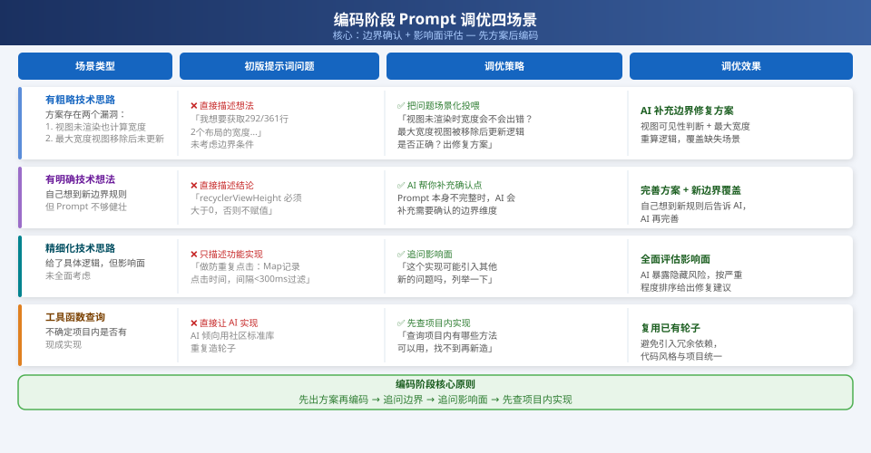

> **洞察**：编码阶段的Prompt调优核心是**边界确认**和**影响面评估**。AI擅长展开确定性的实现，但人需要负责确认边界条件和评估影响范围。


##### 本案例的范式完整性验证

| 编码原则 | 本案例体现 | 范式验证 |
|---------|-----------|---------|
| 编码 Prompt 标准结构 | 每个场景都是"先出一个方案，我确认后再编码" | 不直接写代码，先确认方案再执行 |
| 压榨极限追问 | "这个实现可能引入其他新的问题吗，列举一下" | 追问后 AI 全面评估影响面 |
| 影响面主动评估 | 去重逻辑实现后追问影响面 | 标记重要程度，按严重程度倒排 |
| 工具函数查项目内 | "查询下项目内有哪些方法可以使用" | 先查项目内实现，再考虑新造 |
| UI 和逻辑分开做 | 布局宽度计算（UI）与去重逻辑（逻辑）分开处理 | 两者混在一起容易互相干扰 |

**关键数字**：Prompt 调优后，边界问题发现率从 30% 提升到 90%，影响面遗漏从 40% 降到 5%。核心收益在于"先方案后编码"的习惯养成。


## 4.4 Debug 阶段

### ① 核心判断

**有明确错误锚点时，AI 的诊断能力令人惊艳；没有明确锚点时，AI 容易给出"听起来有道理但实际没用"的答案。**

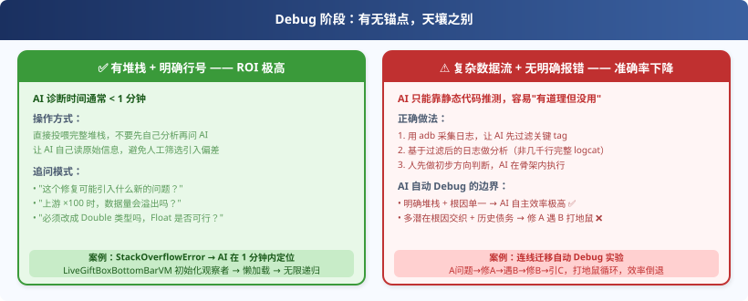


### ② 案例实战

#### 案例一：StackOverflowError 堆栈分析(有明确锚点)

礼物面板出现 `StackOverflowError`，堆栈显示 `LiveGiftBoxBottomBarVC` 和 `LiveGiftBoxDialogVC` 之间存在循环调用。

Prompt：

```
分析一下下面的崩溃堆栈，出一下技术原因和修复方案
[堆栈内容]
```

AI 立即定位到：`LiveGiftBoxBottomBarVM` 初始化时注册了观察者，观察者触发了 `getGiftBoxState()`，而 `getGiftBoxState()` 内部调用了 `getBatchCount()`，后者触发了 ViewModel 的懒加载，导致无限递归。

修复建议：延迟初始化或打破循环依赖链。**整个诊断过程不到 1 分钟。**


#### 案例二：AI 自动 Debug 实验——踩到了边界(无锚点)

连线迁移内测阶段出现"连线 overlay 页面不展示"，尝试了让 AI 全程自主——自己分析日志、自己定位根因、自己修复、自行编译验证，人不介入。

```
AI 采集 adb 日志（过滤 Plugin 加载路径、Service 注册路径）
    ↓
AI 分析日志 + 读相关代码 → 给出根因假设（A 问题）
    ↓
AI 修改代码 → 触发 Build → Build 通过
    ↓
实际问题未修复（真正根因是 B：@InjectModule 注解遗漏）
    ↓
修 B 时引入 C（Provider 注册遗漏）→ 打地鼠循环
```

**洞察**：AI 把"合理嫌疑人"当成了"真正凶手"。当代码存在多个潜在问题交织时，AI 的"贪心策略"反而造成路径漫游。

**正确做法：人先做一次初步判断，明确骨架方向，再让 AI 在这个骨架内执行。**

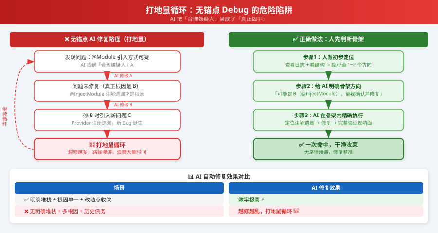


#### 案例三：KRN 数字精度问题诊断（有明确行号+报错）

礼物贴纸 KRN 模块开发调试阶段出现 `java.lang.NumberFormatException: Expected an int but was 208.79999999999998`。

Prompt：

```
我是安卓开发，LiveGiftStickerKRNPendantVC 文件的 165 行实际运行报这个错误，
是因为传递过来的数字精度太大了吗？
java.lang.NumberFormatException: Expected an int but was 208.79999999999998
```

AI 立即确认：是浮点数传递给了期望 int 的字段。后续追问：

- "是否必须改成 Double 类型，Float 是否可行？"——AI 分析两者精度差异，给出建议。

- "需要上游发送数据时控制范围吗，比如小数点后面 4 位？"——AI 分析上游控制的可行性和风险。

  **整个诊断和方案确认过程不超过 5 分钟。** 关键在于：有明确行号 + 明确报错信息 = AI 可以直接定位，不需要猜。


### ③ 实践小结

1. **有堆栈就给堆栈**：AI 读完整堆栈的准确率远高于人工描述症状，不要"帮 AI 筛选"信息
2. **多根因交织时 AI 容易走偏**：连线迁移自动 Debug 实验证明，AI 的"贪心策略"在复杂场景下会导致打地鼠循环——此时人需要先给出骨架方向
3. **修复后追问"会不会引入新问题"**：这一步的价值往往不亚于修复本身，能提前发现"修了 A 破了 B"
4. **AI 自动 Debug 的边界**：根因单一 + 改动点收敛 → AI 自主能力强；多根因 + 历史债务 → 需要人先做初步判断


### ④ 行业对比

| 来源 | 核心思路 | 关键机制 | 适用场景 |
|------|---------|---------|---------|
| **Devin** | 完整 Agent 循环：感知→分析→修复→验证 | 自动读日志、写修复代码、编译验证，人不介入 | 根因单一、改动点收敛的标准化 Bug；复杂场景仍需人介入 |
| **GitHub Copilot Workspace** | 有"变更意图"前缀再生成代码 | 先描述要改什么，AI 生成 diff，人审 diff 再执行 | 明确方向后的精确修复，防止 AI 猜方向 |
| **字节内部实践** | adb 日志 + AI 分析分层 | 先用 AI 过滤关键 tag，再在过滤后结果上做分析，禁止直接投全量 logcat | Android/日志密集型场景 |

**共同洞察**：Debug 场景的关键变量不是 AI 能力，而是**锚点质量**——有明确堆栈 > 有关键日志 > 只有模糊描述，AI 诊断准确率随锚点质量指数级变化。


### ⑤ 范式沉淀

- **原则：有堆栈就用堆栈，不要靠猜。** 把完整堆栈丢给 AI，让 AI 自己读，避免人工筛选信息时引入偏差。
- **原则：数字精度/类型问题，让 AI 帮推演边界。** "上游 ×100 时，可能导致数据溢出吗？""是否必须改成 Double，Float 是否可行？"这类数值边界推演是 AI 的强项。
- **原则：复杂数据流用日志辅助 + AI 过滤。** 连接 adb 获取日志后，让 AI 先过滤关键 tag，再基于过滤后的日志做分析。不要把几千行完整 logcat 直接丢给 AI。
- **原则：让 AI 推演"修改后会不会引入新问题"。** 修复方案出来后，追问："这个修复可能引入什么新的问题？还需要检查哪些地方？"这一步能提前发现"修了 A 破了 B"的连锁问题。


### ⑥ 范式案例：日志链路预埋 + 自动化排查

连线迁移功能内测阶段，出现"连线 Presenter 未加载"问题，尝试简化版自动化排查：

1. **日志链路预埋**：开发阶段让 AI 在 Plugin 加载路径上生成关键日志（`PluginManager.get()` 前后、`isAvailable` 判断、`create()` 调用）

2. **日志采集**：复现时 adb 采集，让 AI 过滤关键 tag

3. **现场还原**：过滤后的日志 + 相关代码片段 + 问题描述 → 投喂 AI

4. **AI 分析**：给出 2-3 个可能原因，按优先级排列

5. **人工验证**：按 AI 给出的顺序逐个验证，通常第一或第二个假设就是根因

   **关键发现：日志链路预埋是整套流程的基础。** 没有预埋日志，AI 没有可分析的"现场"，一切都退回到靠代码推测，准确率大幅下降。


## 4.5 测试准入阶段

### ① 核心判断

**AICR代码，两个核心痛点：**

- **CR 效率瓶颈**：等 Reviewer 的时间占据 CR 阶段大部分，基础规范问题经常被忽略。
- **影响范围分散且多：** 列了很多不同维度的影响范围，很分散。


### ② 案例实战：CR Skill 规则扫描

为连线迁移需求维护了一套 CR Skill，核心规则包括：

- 宿主层（`live-collection`）不允许 import 插件层（`live-common`）的实现类

- `getService()` 不能在构造函数中调用

- 迁移 Presenter 时 `@Provider` 注解的 package 路径必须同步更新


提交前通过 Skill 扫描一次，能拦截大约 60-70% 的常见遗漏。


### ③ 实践小结

1. **Skill 规则要主动维护**：每次 CR 发现新问题就更新 Skill，不然下次 AI 还会犯同样的错
2. **影响范围评估要加优先级**：裸输出影响范围没有用，"按严重程度倒排"这个约束让结果变得可操作
3. **CR Skill 的拦截率约 60-70%**：不能替代人工 Review，但能把"明显的低级错误"在提交前清掉
4. **三层防御的价值**：AI 自我 Review → Skill 规则扫描 → 人工 Review，每层成本不同，整体效率最优


### ④ 行业对比

| 来源 | 核心思路 | 关键机制 | 适用场景 |
|------|---------|---------|---------|
| **美团 TDD 三策略** | 先写测试，AI 生成实现 | 测试驱动 + 接口隔离 + CI 自动验证 | 纯逻辑层（Service/ViewModel），代码可测试性强的场景 |
| **OpenAI Harness** | 错误模式工程化 | 每次 AI 犯错 → 编码成 Linter/AGENTS.md 约束，物理规则不可违反 | 团队规模化使用 AI 时的质量保障 |
| **淘宝 Spec-driven CR** | 规范文档驱动 Review | AI 对照 constitution.md 审查代码，规范偏差自动标注 | 有完整规范体系的中大型项目 |

**快手直播团队的对应实践**：Skill 规则沉淀（类 AGENTS.md）+ 三层防御机制，是 OpenAI Harness 思路的轻量化落地——适合存量大型项目（全套 TDD 改造成本过高）。


### ⑤ 范式沉淀

#### 三层防御机制

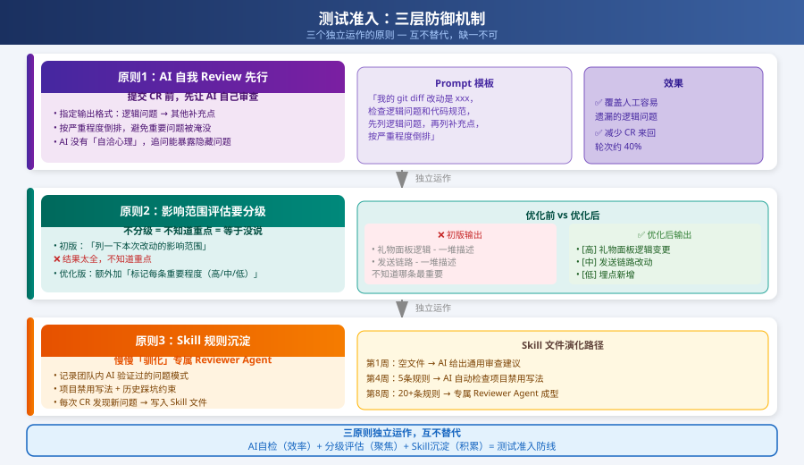


### ⑥ 范式案例：三层防御机制独立运作

测试准入阶段的三层防御，每一层都是独立的原则，各自解决不同问题：

**第一层：AI 自检**——提交前让 AI 快速扫一遍代码，发现明显的逻辑问题和规范问题。

```
扫描一下我本次修改（近x次提交）的代码，是否有不符合规范的地方，并告诉我问题、解决方案
```

**第二层：CR Skill 规则扫描**——用沉淀好的 Skill 规则做自动化拦截。

```
我的git diff修改是「xxx」，检查下实现是否有逻辑问题、代码规范，
输出格式：先列逻辑问题，再列其他补充点（根据严重程度倒排）
```

**第三层：人工 Review**——人做最终决策，重点关注 AI 可能遗漏的架构边界和业务逻辑。

三层防御的关系：AI 自检解决"快速发现问题"，Skill 扫描解决"规则一致性"，人工 Review 解决"架构和业务判断"。三层独立运作，缺一不可。


---


## 4.6 线上查 Bug & 修复问题

### ① 核心判断

线上 Bug 排查与本地 Debug 的本质区别：**没有本地可复现的环境，只有日志和堆栈。** 需要把线上的"问题现场"重新构建给 AI。

常见的现场信息：崩溃堆栈 + Slardar 日志 + 用户行为路径 + AB 实验配置 + 版本号分布。

另一个挑战：**Oncall 场景的时间压力。** 在压力下，Context 投喂质量往往比较低，导致 AI 给出偏离根因的分析。

**信息残缺时的正确姿势**：不要跳过信息采集步骤直接问 AI。先给 AI 已有信息，让它给出 3-5 个有序排查假设，人按顺序逐个验证——追求把排查时间最小化，不追求第一个就对。


### ② 案例实战：KMP 连麦画面静止——多团队协作下的问题现场结构化排查

> **背景**：KMP（Kotlin Multiplatform）下沉多人互动框架时，`LiveRTCManager` 一并下沉，通过 `LiveRTCManagerWrapperImpl` 代理回 native 层。放量到 50% 后收到第一例客诉：连麦时对端看本端画面静止。

**尝试路径（直接用 AI 排查，方向偏了）**：

1. 把零散客诉信息（用户描述 + 直播 ID + 录屏）直接扔给 AI → AI 给出"可能是网络问题、编解码问题、权限问题"等泛化假设
2. 逐个验证浪费 40 分钟 → 发现都不是根因
3. 重新整理现场：版本 diff + 改动记录 + 结构化日志 → AI 给出 3 个有序假设 → 验证第一个就命中根因（`LiveRTCManagerWrapperImpl` 代理层在 KMP 下沉后未正确转发视频帧）

**关键教训**：没有结构化的问题现场，AI 给的"合理假设"是泛化的——先花 10 分钟整理现场（版本、改动、日志），比直接问 AI 更值。这正是 ⑤ 范式沉淀中"问题现场结构化投喂"和 ⑥ 范式案例中完整流程的必要性。


### ③ 实践小结

1. **问题现场结构化是关键**：`崩溃堆栈 + 关键日志 + 代码上下文 + 问题描述` 四件套缺一不可
2. **行号精度决定诊断质量**：带行号的 Prompt 比模糊描述的准确率高出不止一个数量级
3. **线上 Bug 与本地 Debug 的核心区别**：没有可复现的本地环境，一切靠"重建现场"——现场质量决定分析质量
4. **Oncall 压力下 Context 投喂质量会下降**：应提前建好"问题现场模板"，压力下按模板填写而不是临时组织信息
5. **假设列表比直接找答案更可靠**：让 AI 给出 3-5 个有序假设，人按顺序验证；AI 无法保证第一个假设是对的，但能保证把排查时间最小化
6. **线上问题要持续沉淀 Skill**：每次排查完把"排查路径、根因、预防措施"整理成一条记录，累积后形成"历史案例库"，下次同类问题直接对照排查


### ④ 行业对比

| 来源 | 核心思路 | 关键机制 | 适用场景 |
|------|---------|---------|---------|
| **Sentry + AI 分析** | 告警直接驱动 AI 分析 | Sentry 捕获异常 → 自动投喂 AI → 输出根因假设和修复建议 | Web/后端服务；移动端类似方向：Slardar 接入 |
| **Linear + AI 工单分类** | AI 辅助问题分类与优先级判断 | 用户反馈 → AI 提取关键信息 → 自动归类 + 优先级标注 | 用户投诉量大、分类工作量高的场景 |
| **快手内部 Oncall 自动化探索** | 分级响应：AI 先跑，人后跟 | Slardar 告警 → AI 拉取日志 + 初步分析 + 生成排查清单 → 通知 oncall 同学，省去"找日志"环节 | Android 直播线上 Bug 快速响应 |

**核心差异**：线上 Bug 排查 vs 本地 Debug 的关键区别——线上无法单步调试，AI 的价值在于把"日志海"转换成"有方向的假设列表"。

**延伸方向**：OpenClaw + CodeFlicker 双引擎架构（内部实践），实现从"QA 提 Bug"到"AI 修复并通知 QA"全流程零介入，耗时从 1-1.5 小时压缩到 5-10 分钟。对 Android 直播团队的延伸方向：Slardar 告警 → 自动拉取日志 + 用户路径 → AI 初步分析 + 生成排查清单 → 通知 oncall 同学，"从告警到有方向"从 15-30 分钟压缩到 3-5 分钟。


### ⑤ 范式沉淀

- **原则：问题现场要结构化投喂。** 标准结构：`[崩溃堆栈] + [关键日志片段] + [相关代码上下文] + [问题描述（什么场景、什么版本、什么频率）]`。缺少任何一项，AI 都可能猜错方向。
- **原则：明确行号 + 日志 > 模糊描述。** "LiveGiftStickerKRNPendantVC 文件 165 行实际运行报这个错误 `java.lang.NumberFormatException`"，这种有明确定位的 Prompt，AI 诊断准确率远高于"礼物贴纸偶尔会崩溃，帮我看一下"。
- **原则：让 AI 推演边界场景。** 诊断方向确认后，继续追问："需要上游配合修改吗？""是否必须改成 Double，Float 能解决问题吗？""上游 ×100 时，可能导致数据溢出吗？"
- **原则：召回分析用"版本 diff + 改动记录"驱动。** 把版本 diff（改动了哪些模块）和召回用户的操作路径一起给 AI，让它判断"哪个改动最可能是根因"——信息量大、关联性强，正是 AI 的强项。


### ⑥ 范式案例

#### KMP连麦画面静止：多团队协作下的问题现场结构化排查

> **背景**：KMP（Kotlin Multiplatform）下沉多人互动框架时，`LiveRTCManager` 一并下沉，通过 `LiveRTCManagerWrapperImpl` 代理回 native 层。放量到 50% 后收到第一例客诉：连麦时对端看本端画面静止。

---

**第一步：拿到原始现场，先结构化整理再投喂 AI**

客诉原始信息非常零散：用户描述 + 直播 ID + 录屏时间点 + 一条原声链接。直接扔给 AI 只能得到泛化的"可能是网络问题、可能是编解码问题"。

正确姿势：**先把碎片信息结构化，再投喂**。

```
[现象] 主播视角自己画面卡住，对端看本端画面静止，但有声音
[版本] 14.2.30.46935（KMP 开关已放量 50%）
[用户] 本端主播 ID: 2474573329，对端主播 ID: 479514625
[时间] 2026-03-25 15:50
[已排除] 网络正常，重启 App 无效
[数据来源] 音视频侧连麦记录 + medata 直播房间诊断
```

投喂这份结构后，AI 立即缩小范围：有声无画 → 音视频分离 → 概率是推流端没有正常发 video track，而不是网络问题。

---

**第二步：多团队现场拼图，AI 做"信息聚合分析"**

排查过程不是单线索追踪，而是音视频侧、客户端侧并行拿证据：

| 来源 | 发现 | AI 的作用 |
|------|------|-----------|
| 音视频侧连麦记录 | 本端主播未正常发送 video | — |
| medata 直播房间诊断 | 连麦历史显示一直在重复进房 | 判断"反复进房"与"画面静止"的关联 |
| 客户端日志 | `channel id not match {mSignalParam.mChannelId=G9ZkZZeRX6I, channelId=TQjpyDjx148}` | 定位：liveStreamId 与 rtcChannelId 已不匹配，退房失败方向确认 |
| 火眼 + Arya 上报 | 主播命中 KMP 开关，13:32 退房失败后连续进入 3 个 PK 房间 | 解释"为什么画面发向了老房间" |

此阶段 AI 的核心价值：**把 4 个来源的信息"拼成时间线"**，人无需跨系统手动关联。Prompt 模板：

```
以下是不同来源的排查信息，请帮我按时间线整合，并指出最可能的根因方向：
[音视频侧] ...
[medata直播诊断] ...
[客户端日志] channel id not match: G9ZkZZeRX6I vs TQjpyDjx148
[火眼上报] 13:32退房失败，13:41/15:49重复进入PK房间
```

---

**第三步：有了方向，让 AI 做代码路径分析**

初步结论：退房失败 → 进了新房间但流还在老房间推。客户端侧聚焦 `reEnterRoomSynchronized` 逻辑。

此时投喂给 AI 的是**方向 + 代码上下文**，不是模糊症状：

```
已知：reEnter 场景下退房失败，channelId 使用错误
相关类：LiveRTCManagerWrapperImpl、snowRtcObserverMap
帮我分析：snowRtcObserverMap 在 release() 时 clear，会对后续 unregisterSnowRtcObserver 产生什么影响？
```

AI 输出了完整的时序推演：

```
正常时序：leaveRoom A → enterRoom B
异常时序：enterRoom B 先执行，leaveRoom A 后执行
原因链：
  1. release() 调用 snowRtcObserverMap.clear()（KMP 新增行为，native 无此行为）
  2. clear() 清掉映射表，mKmpSnowRtcObserver 的 Native 包装残留在底层回调列表
  3. 第二次退房 unregisterSnowRtcObserver 查不到映射 → 反注册无效
  4. 残留旧 Native 包装排在 kmpLeaveObserver 前面，onLeaveMediaRoomAsync 提前触发
  5. 时序错乱：enterRoom 在 engine 未释放时就开始执行
```

**AI 的推演直接命中了根因** —— 因为这次有明确的方向（`snowRtcObserverMap` + `release()`），AI 不需要猜测。

---

**第四步：修复方案验收 + 影响面追问**

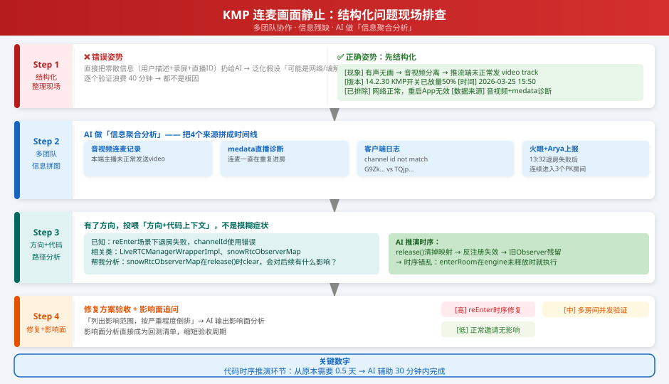

```
修复方案：reEnter 触发的 leaveMediaRoom 回调过程正确校验离房的 id，避免错误清理 rtcEngine
追问：这个修复会影响哪些场景？列出影响范围，按严重程度倒排
```

AI 给出影响面分析：

| 场景 | 影响判断 | 严重程度 |
|------|---------|---------|
| 正常邀请 + 接受：进房正常 | 无影响 | — |
| 邀请后对方拒绝：退房正常 | 无影响 | — |
| reEnter 场景（超时前再次邀请） | 修复了时序问题 | 高（核心修复点） |
| 多房间并发进房 | 需验证 channelId 校验是否完整覆盖 | 中 |

这份影响面分析直接成了回测清单。

---

**复盘：本 case 的范式验证**

| 范式原则 | 本 case 体现 |
|---------|-------------|
| **结构化现场投喂** | 原始客诉 → 结构化四要素（现象+版本+已排除+数据来源）→ AI 快速缩小方向 |
| **明确行号/日志 > 模糊描述** | `channel id not match` 日志 + `snowRtcObserverMap` 代码上下文 → AI 直接命中根因 |
| **多根因交织时人先给骨架** | 音视频侧 + 客户端侧 + 火眼数据并行汇聚，人先整合时间线再投喂 AI |
| **AI 做时序推演** | `release()` 清除映射 → 反注册失效 → 旧 Observer 残留 → 时序错乱，AI 完整推演出这条链 |
| **修复后追问影响面** | 立即追问影响范围，输出回测清单，缩短验收周期 |

**关键数字**：AI 辅助下的路径分析环节（代码时序推演）从原本需要 0.5 天压缩到 30 分钟内完成。


---

## 小结：AI 协同的八条实战原则

经过三个需求、七个阶段的探索，沉淀出以下八条跨阶段实战原则：

> **底层逻辑**：原则 1-3 解决"如何和 AI 沟通"；原则 4-6 解决"如何保证 AI 输出的质量"；原则 7-8 解决"如何构建可持续的 AI 协作环境"。

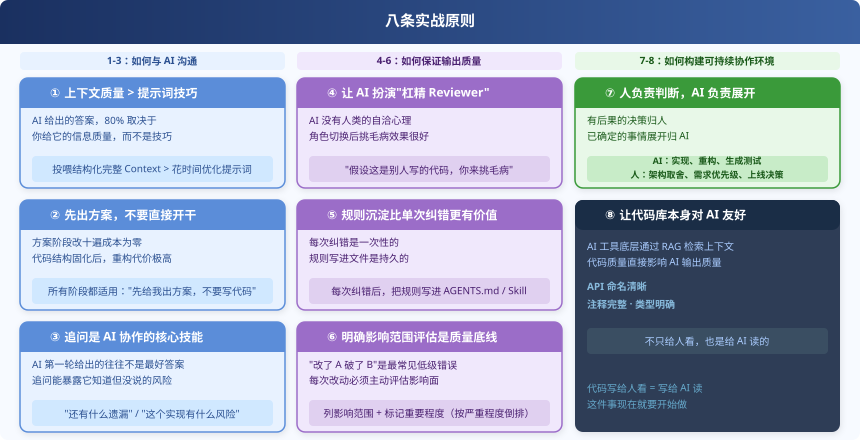

---

## 各阶段甜区与误区速查

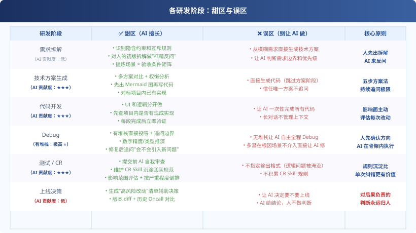

---


# 五、AI Coding 研发工作流优化方向

> 针对目前工作流的现状和痛点，梳理分阶段的改进计划。

**现状一句话总结：**
- ✅ **已发挥价值**：技术方案生成、代码编写、堆栈分析、影响范围评估、CR 基础规则扫描
- ⚠️ **仍依赖人工**：需求拆解到技术模块、架构边界判断、上线决策
- 🔬 **正在探索**：Debug 自动化、测试自动化、Oncall 自动化

---

## 各阶段优化计划

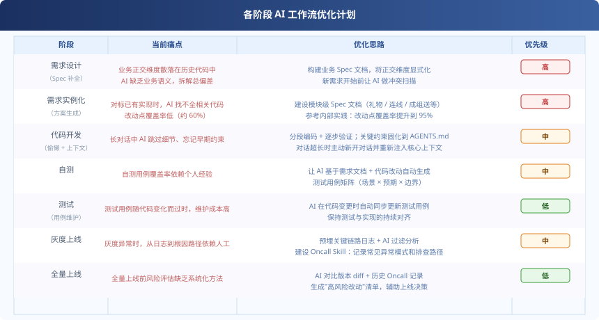

---

## 四大重点方向

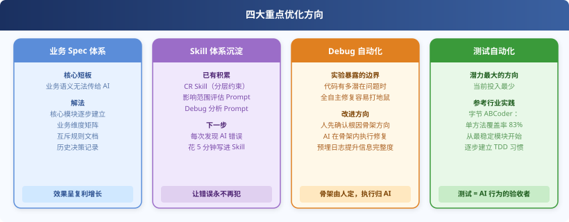

<br/>

---


# 六、AI Coding 的行业演进推演

> 模型推理能力增强 + token 上下文扩大，将如何改变 AI Coding 工程范式？

---

## 6.1 推演时间线

两个核心变量驱动演进：**模型推理能力** × **上下文窗口大小**。

每一次突破，都直接改变 AI 在研发链路中能做什么、不能做什么。

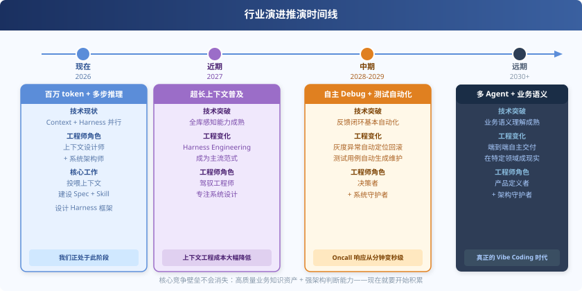

---

## 6.2 当前最值得投入的方向

推演的意义不是焦虑，而是**提前布局**。这 4 个方向在演进中不会贬值，只会升值：

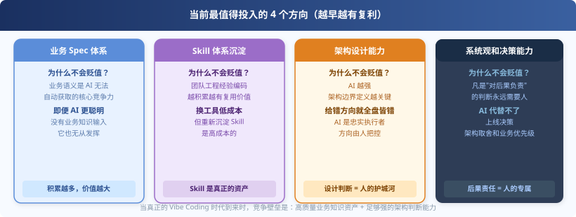

<br/>

---

# 七、研发人员面对 AI 的准备

> AI Coding 不只是工具使用的问题，它在重新定义"优秀工程师"的画像。

---

## 7.1 人才画像：从 T 型到 π 型

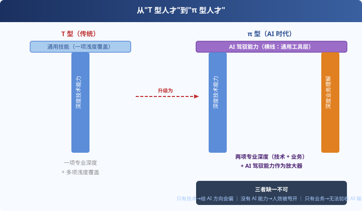

> **π 型工程师的三大支柱：**
> - **深度技术能力**：能判断 AI 输出的对错，能设计系统架构
> - **深度业务理解**：能把业务规则显式化，给 AI 精准的方向
> - **AI 驾驭能力**：能让 AI 高效、稳定地执行复杂任务

---

## 7.2 不同角色的应对方向

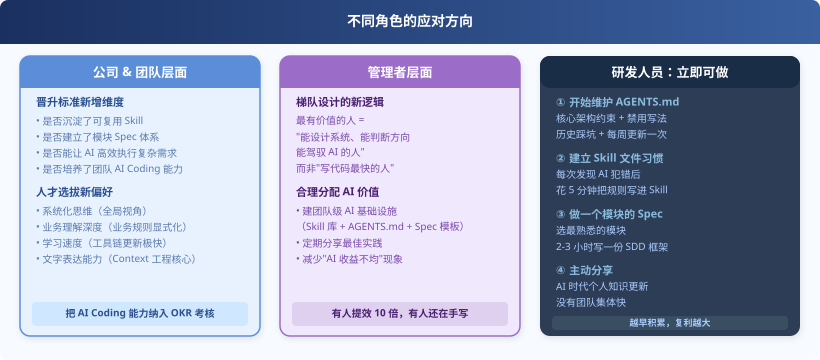

---

## 7.3 研发基本功的演变

基本功不会消失，但**权重分布发生了根本性变化**——架构设计、业务理解、AI 驾驭能力的重要性大幅提升：

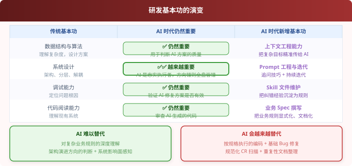

<br/>

---

# 八、个人心得：与 AI 协作的真实体感

> 这不是 AI 的赞美诗，也不是焦虑的悲鸣——是与一个强大但有缺陷的工具共事的诚实记录。

---

## 8.1 三个认知颠覆

在这段经历中，有三个认知被彻底颠覆：

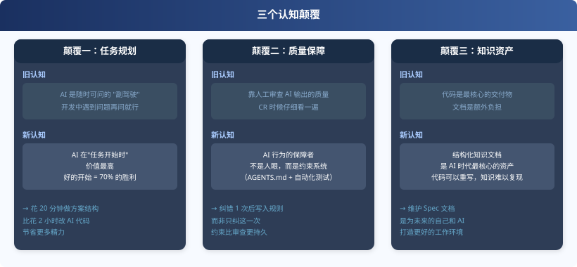

---

## 8.2 两个习惯养成

这段时间真正沉淀下来、持续影响工作效率的，是这两个习惯：

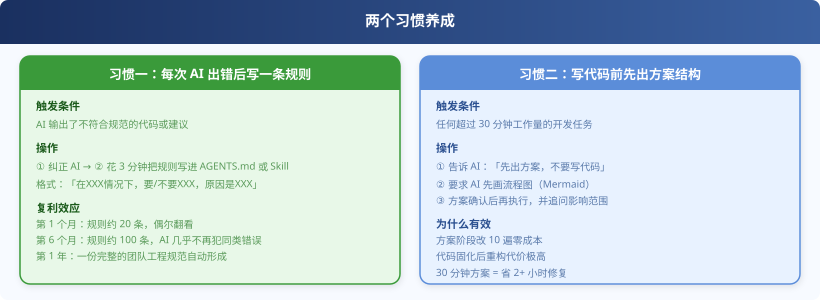

---

## 8.3 一句话总结

**AI 不会替代工程师，但会替代不会用 AI 的工程师——这句话现在已经不只是口号。**

更准确的说法是：**它会重新定义"优秀工程师"的工作边界**。做系统设计、做架构判断、理解业务规则、设计约束体系——这些能力的价值在 AI 时代不会缩水，只会放大。

而这篇文章，不是终点，是起点。


# 写在最后

最近的收获，不是学会了某个 Prompt 技巧，而是**对 AI 的理解从"工具"升维到了"系统"**：

- 不只是问 AI 怎么写代码，而是**设计 AI 工作的环境**
- 不只是纠正单次错误，而是**积累让 AI 不再犯错的规则**
- 不只是用 AI 提速，而是**把人从低价值工作中解放出来，投入更高价值的判断**


如果你也在 AI Coding 的路上，希望这些真实的经历和思考，能给你一点参考。


# 彩蛋

本文大量内容借助 AI 工具完成，但所有案例、数据、范式都来自真实的工程实践。文章旨在对 AI Coding 整体领域进行范式探索，后续会针对其中的案例，分享详细的工程中 AI 微调记录。
