**连屏领域架构产研讨论**

# **一、连屏业务领域建模**

### **1.1 什么是领域建模？有什么好处？**

**简单说，领域模型就像一张 “业务说明书”，它不涉及技术实现（比如用什么编程语言），只回答 “业务里有什么”“它们之间怎么互动”“要遵守什么规则”。**

**1）一句话描述**

领域建模是 **把复杂的业务场景 “翻译” 成简单易懂的 “业务地图”** 的过程。它聚焦于业务的**核心概念**（比如电商里的 “订单”“商品”“用户”）、**概念之间的关系**（比如 “订单包含商品”“用户创建订单”），以及**业务规则**（比如 “订单支付后才能发货”），用图形或文字的方式把这些核心要素清晰地呈现出来。

**2）好处是什么？**

领域建模的核心价值是 “对齐认知、减少内耗”，具体好处体现在研发和产品协作的全流程中：

- **让产研测 “说同一种语言”（显性化）**：产品经理可能用 “用户下单后库存扣减” 描述需求，研发可能关注 “数据怎么流转”。领域模型通过统一的概念（比如 “订单状态”“库存扣减规则”），让双方对业务的理解一致，避免 “产品说 A，研发做 B” 的偏差。
- **提前暴露逻辑漏洞**：建模时需要梳理清楚 “边界”（比如 “虚拟商品不需要物流，实物商品需要”）和 “规则冲突”（比如 “库存不足时订单能否创建”）。这些问题在建模阶段暴露，比开发后再改成本低 10 倍以上。
- **支撑灵活迭代（解耦）**：业务会变（比如新增 “预售订单” 类型），但核心领域模型相对稳定（“订单” 的核心要素不变）。基于稳定的模型扩展新功能，研发不需要推翻重来，产品也能更高效地推进迭代。
- **沉淀业务知识，降低新人门槛**：成熟的领域模型是团队的 “业务知识库”。新人通过模型能快速理解 “业务的骨架”，不用反复追问老员工 “这个概念是什么意思”。

### **1.2 没有领域建模情况下的日常case**

| 具体case                                   | 产品视角                                                     | 研发视角                                                     | 具体问题                            |
| ------------------------------------------ | ------------------------------------------------------------ | ------------------------------------------------------------ | ----------------------------------- |
| case1：啥是连屏大哥位？                    | MVP条上面的嘉宾区域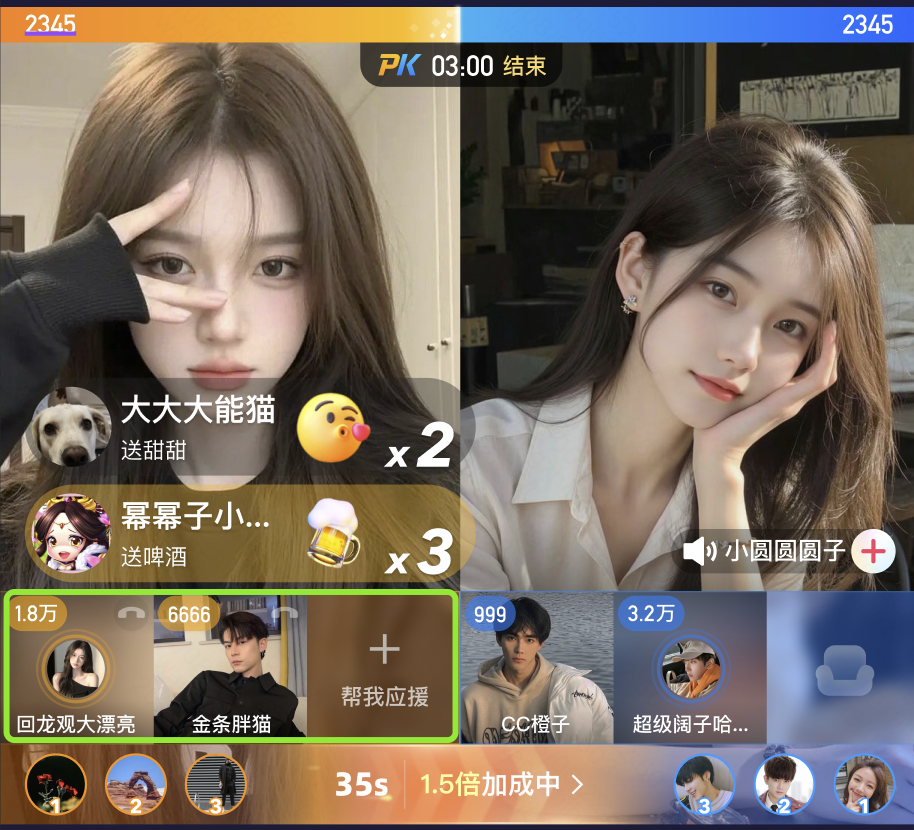 | MVP条里的大哥位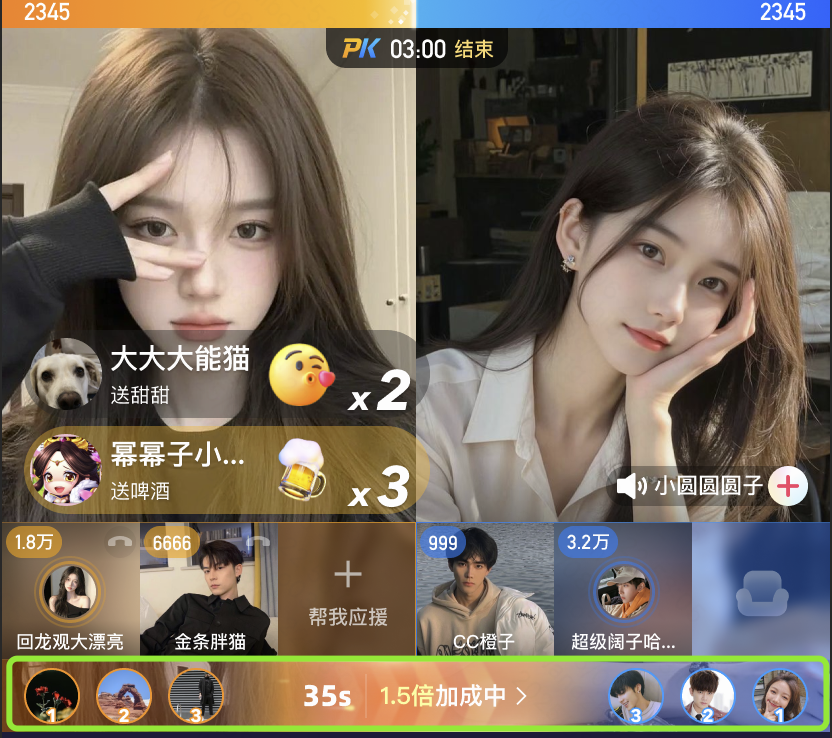 | 沟通效率低，有歧义                  |
| case2：大哥上麦产品建议把MVP条放到血条下面 | MVP条放到血条下面                                            | 血条下面会和连胜标签、分数等冲突                             | 技术不可行，设计返工&反复沟通成本高 |

### **1.3 连屏业务领域建模探讨**

**1）领域建模一般过程**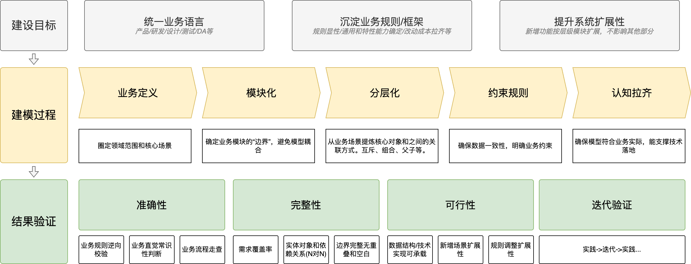

**2）研发视角下的业务建模（供参考）** 

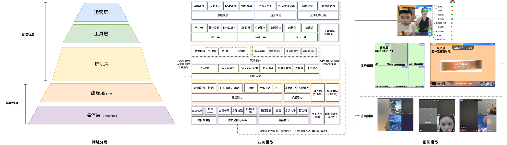

**以近期连屏需求举例**

| 需求                                                         | 业务PRD描述                                                  | 领域模型描述                                                 |
| ------------------------------------------------------------ | ------------------------------------------------------------ | ------------------------------------------------------------ |
| 提PK期间R类用户参与感——大哥上座 | 在pk过程中增加观众连麦功能，经主播确认后，观众可进行上麦，帮助主播在pk时喊麦口播；通过 pk 直播间设置上麦功能，营造直播间激烈氛围，带动直播间送礼氛围提升，强化“将军”的参与感；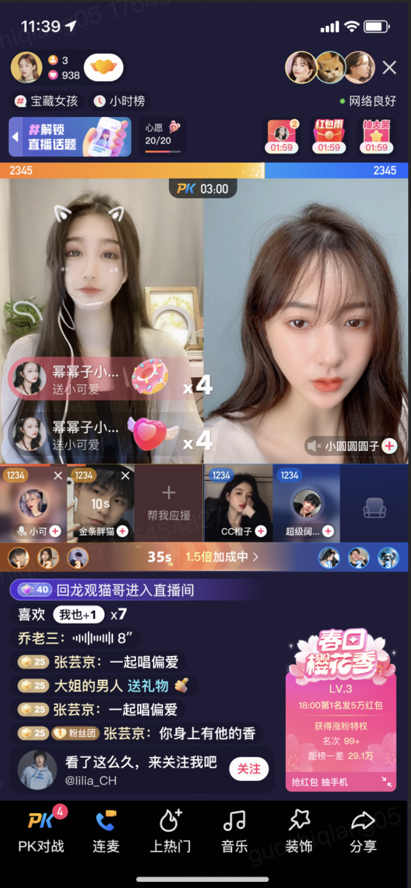 | 业务模型**媒体层：**音视频、背景图、组队静音等能力，涉及音视频传输、流布局的改造**建联层：**新增观众上麦建联组件；**玩法层：**新增连麦玩法，属于PK下的子插件，作为玩法层的通用插件，可后续为其他玩法服务；视图模型**窗格层：**新增嘉宾申请入口、分数统计、人员信息；**玩法层：**调整 MVP 位置，和连麦嘉宾窗格跨层级对齐； |
| 连屏布局能力拓展 | 让连屏支持更大的画面，一方面是，让现有PK画面尺寸直接放大；另一方面是，主播们有能力，操作放大其中某一个主播画面；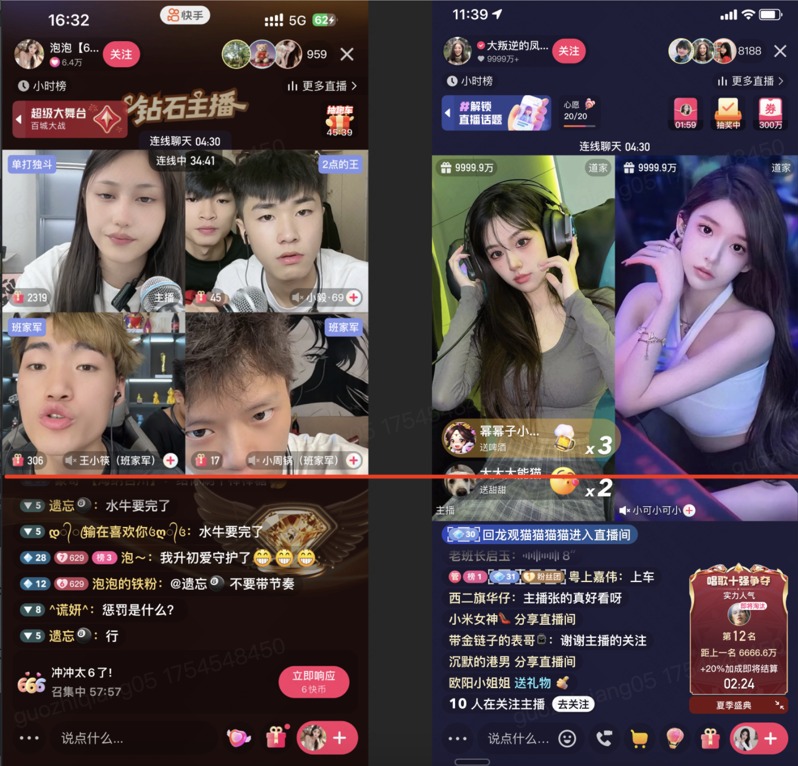 | 业务模型**媒体层：**放大某个主播画面，涉及流布局的改造；视图模型**流画面层：**流画面由原本9:8尺寸，向下拓展到9:9尺寸，涉及流布局的改造；UI层**窗格层：**宫格四角位置调整；**玩法层：**PK条、计分器相关的调整对非 PK 功能的影响，礼物槽、公屏区 |

**3）各团队视角下的统一业务建模（待讨论）**

**产品：**

**设计：**

**研发：**

# **二、客户端技术架构现状**

### **2.1 技术架构现状&技术能力**

**1）技术架构图 （WIP）**

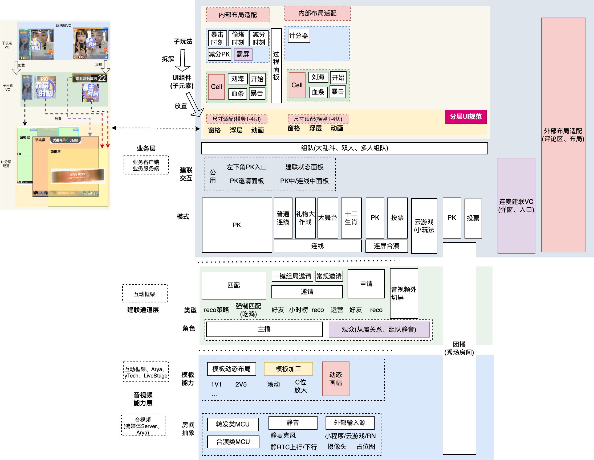

**2）技术架构与业务建模的GAP和问题**

| GAP 1：业务层的**通用插件** 现状与业务建模不对齐             |
| ------------------------------------------------------------ |
| 对比产品视角：血条刘海在玩法层中是 **通用插件**，可以跨玩法(PK、连线)复用技术现状：血条刘海在玩法层各个玩法的 **特性插件**，并未迁移到 **通用插件**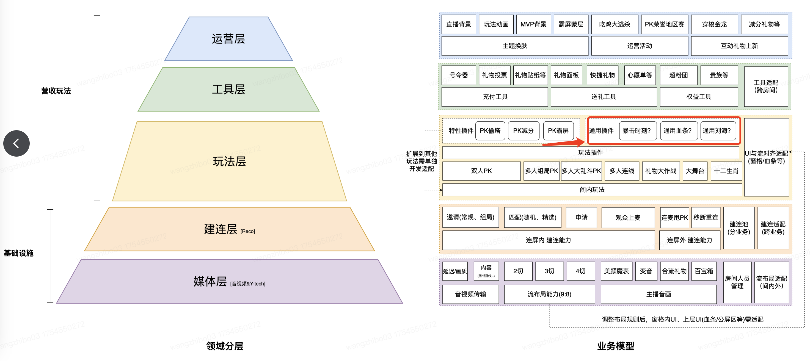具体问题：血条、刘海、计分器在玩法层各个玩法的 **特性插件**，无法跨PK、连线业务复用，新增和迭代时需要维护2份成本，例如PK火力赛需求，刘海新增规则入口，成本是12.5pd；营收通用运营需求讨论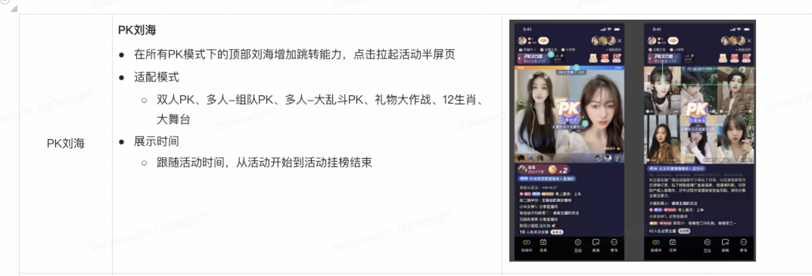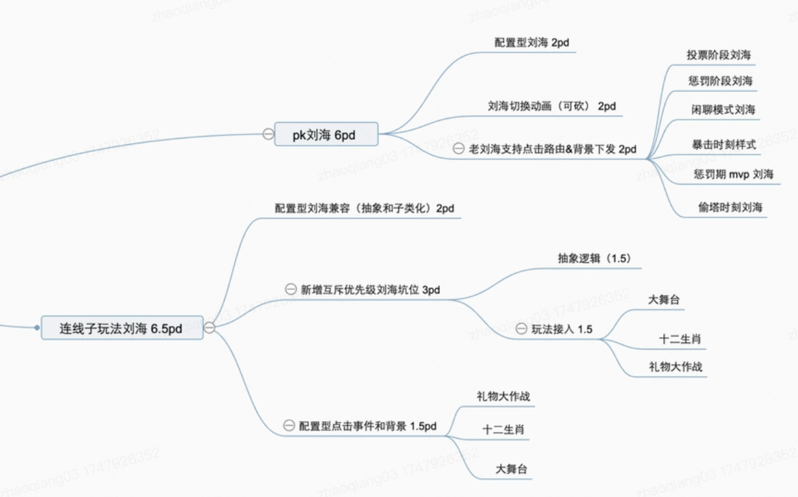 |
| GAP 2：建联层现状 和业务层级不对齐                           |
| 对比产品视角：建联组件在建联层，可以多个玩法复用技术现状：建联组件是特性化插件，而非通用化插件，对PK、连线状态有依赖，不能跨玩法复用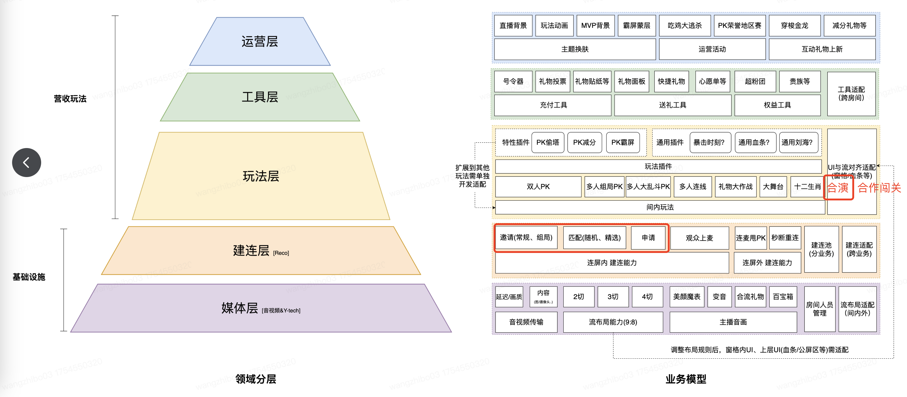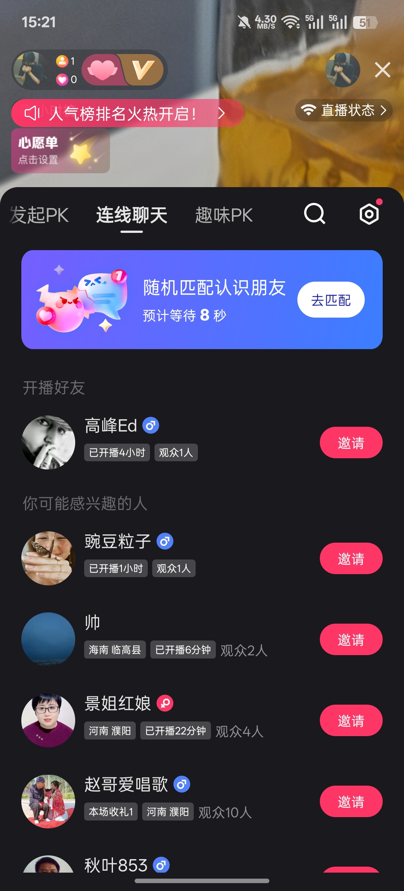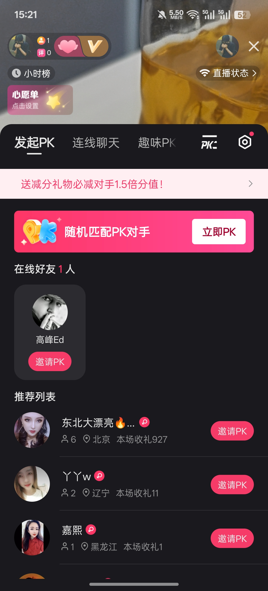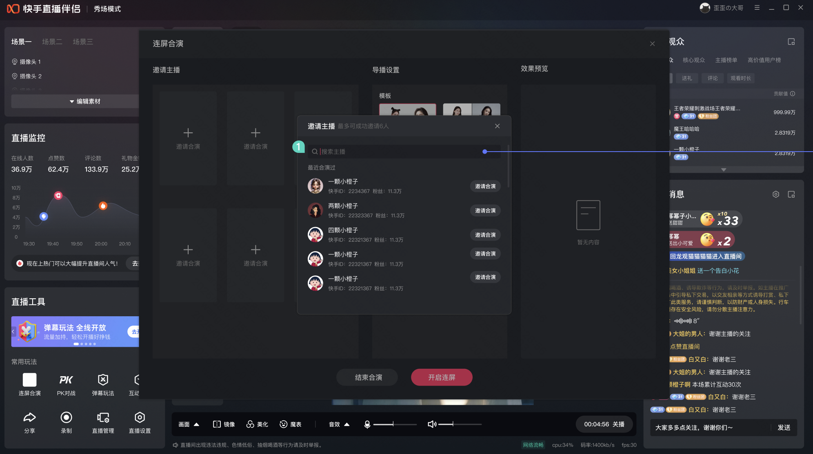连线PK连屏合演 具体问题：PK、连线建联有2套UI交互，新增一个玩法(合演、合作闯关)可能需要额外新增邀请、匹配、申请面板(10pd+)； |

# **三、连屏规划产研讨论**

### **3.1 技术架构演进（for 提效，by 跨端技术）**

- 动态化：建联面板建设，共xx个面板，其中xx个面板已动态化，xx个面板未动态化；
- 层级架构迁移&运营能提升：xx组件从xx层迁移到xx层，预期xx组件变更在xx层可复用；

### **3.2 业务能力扩展（for 交互体验创新）**

**1）玩法层：特性插件(暴击时刻、偷塔时刻、霸屏)扩展成通用插件，各玩法(大舞台/礼物大作战/十二生肖等) 可复用通用插件。**

**2）建联层：**特性建联交互改造成通用交互，比如合演邀请能复用PK的邀请交互、合演支持观众上麦

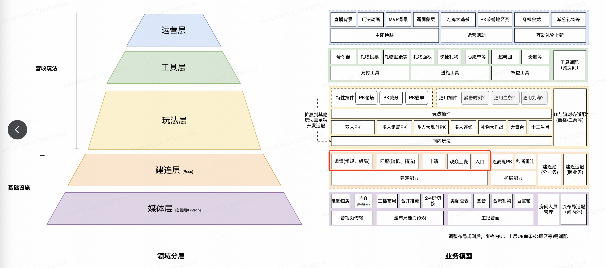

**3）媒体层：布局&音画能力扩展**

- 支持布局画面尺寸比例和宽高可任意配置，同时适配玩法层各类玩法；
- 支持布局画面更强的特效渲染，通过接入ME做效果增强，同时适配玩法层各类玩法；

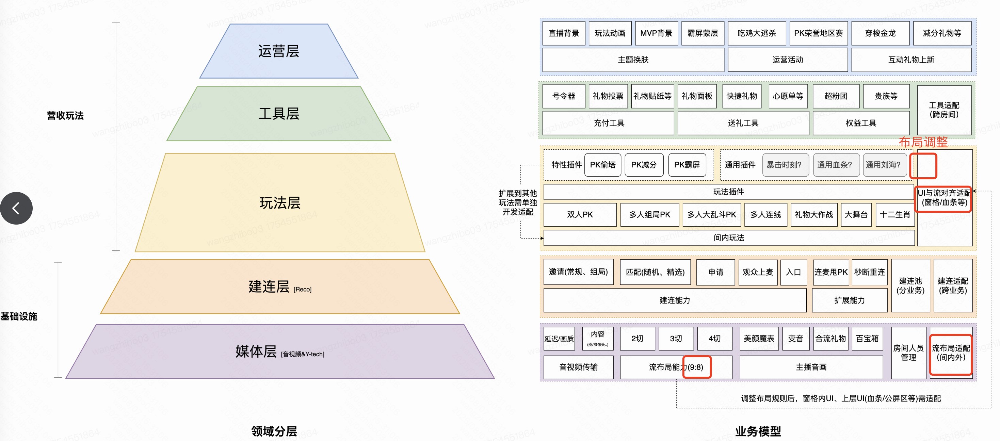

### **3.3 业务基础数据和插件原子化，支持平台or主播自主编排（长期）**

|        | 原子能力                                                     | 组合示例                                                     |
| ------ | ------------------------------------------------------------ | ------------------------------------------------------------ |
| 玩法层 | 玩法PK连线、礼物大作战、大舞台、十二生肖插件**UI插件**：血条、刘海**通用玩法插件**：暴击时刻、偷塔时刻、霸屏 | **玩法层**(大舞台) ***组件层***(观众上麦)*  ***模板层**(布局拉高 * 上下滚动 * 合演)**玩法层**(礼物大作战) ***组件层***(*暴击时刻)  ***模板层**(布局拉高*C位放大) |
| 建联层 | **建联：**邀请、匹配、申请、观众上麦                         |                                                              |
| 媒体层 | 用户类型(主播、观众)房间类型(RTC、合演)模板布局(组队/大乱斗、1-4切)模板尺寸(动态高度)模板加工(C位放大、上下滚动) |                                                              |

### **3.4 AI创新** 

- 基于连屏场景AI智能体方案-我组有个点子王

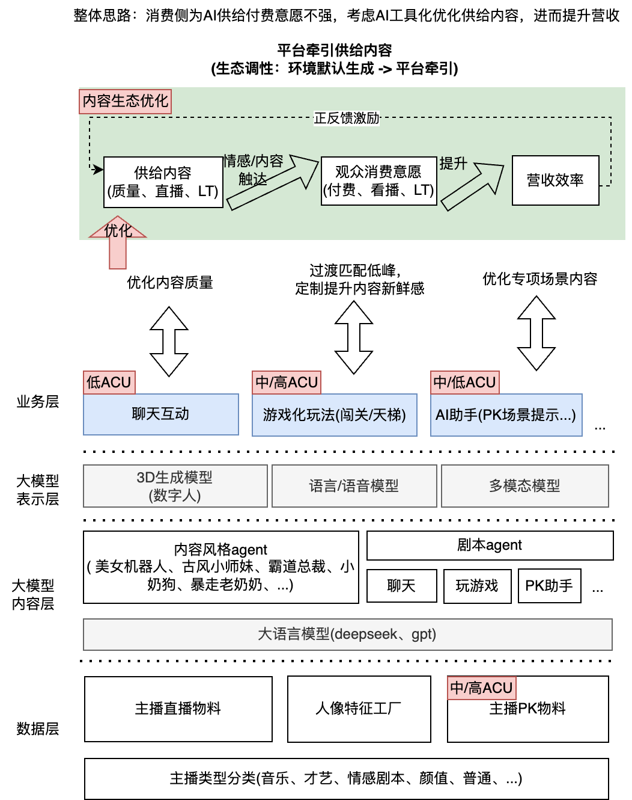

# **四、行业竞品架构和演进思路**

### **4.1 DY技术架构图**

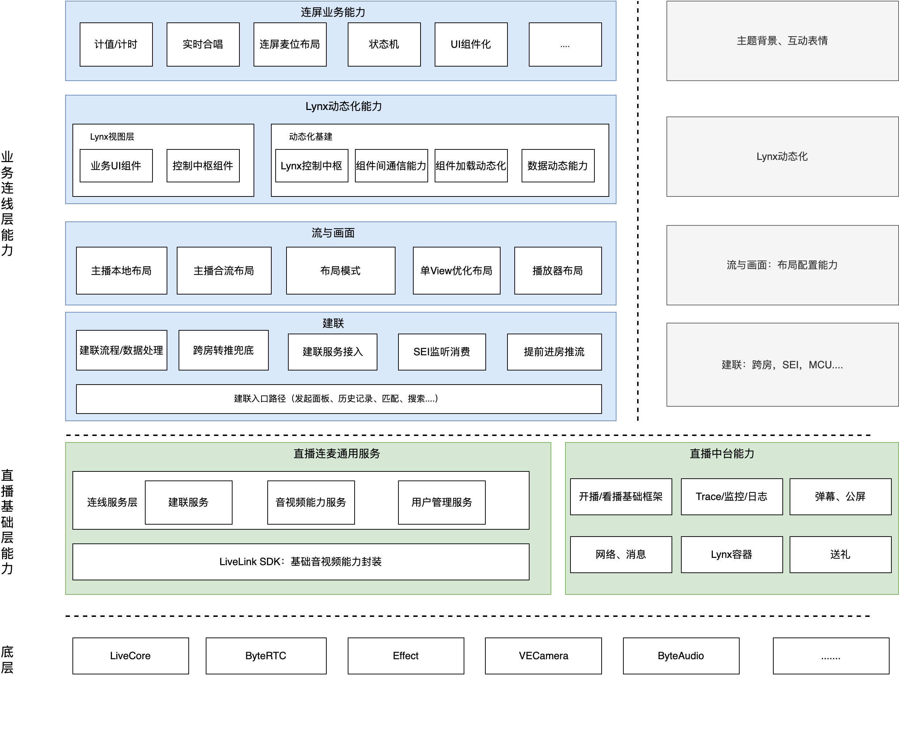

### **4.2 DY技术规划**

- Live跨端框架跨平台：跨端框架+Lynx覆盖80%营收业务；
  - 连屏场景：玩法层动态化：覆盖Android/iOS/鸿蒙/伴侣，25年收尾；建联层动态化（业务逻辑+面板），需求动态化率45%->85%，客户端代码-2w行；
- 架构优化：升级礼物面板、队列等iOS端架构，优化代码重复度、复杂度等；Swift基础组件+开发范式；

- LLM应用：基于线上连屏直播间挖掘野生创意玩法，生成运营脚本，便于后续提高运营效率，沉淀&补充连屏玩法；

# **五、附录**

**1）分层架构基本原则**

分层架构是**把系统按 “职责” 拆分成不同的 “层级”**，让每个层级只负责一类特定工作，层级之间通过固定的 “接口” 协作。就像餐厅的分工：后厨分 “洗菜区”“烹饪区”“装盘区”，每个区域只做自己的事，互不干扰，但最终共同完成一道菜。

- **单一职责：每层只干 “一件事”**
  - 比如表现层只负责 “用户看到什么、点了什么”，不处理业务规则（比如 “这个订单能不能取消” 应该由业务层判断）；数据层只负责 “存数据”，不关心 “数据用来做什么业务”。就像餐厅里 “洗菜的不负责炒菜”，各管一段，职责清晰。
- **依赖单向：只能 “上层依赖下层，下层不依赖上层”**
  - 比如表现层可以调用业务层的接口（“用户点了支付，表现层告诉业务层‘该执行支付逻辑了’”），但业务层不能反过来调用表现层（“业务层不需要关心用户看到的按钮长什么样”）。如果下层依赖上层，就会变成 “炒菜的指挥洗菜的”，逻辑混乱。
- **层内高内聚，层间低耦合**
  - “高内聚” 指同一层的功能要紧密相关（比如业务层里的 “订单创建”“订单取消” 都属于 “订单管理”，放在一起更清晰）；“低耦合” 指层与层之间的联系要尽可能简单（比如业务层只需要告诉数据层 “存一个订单”，不用关心数据层是存在 MySQL 还是 MongoDB）。这样某一层改代码时，其他层几乎不用动。
- **可替换性：只要接口不变，层的实现能随便换**
  - 比如表现层原来用 “网页” 展示，后来想换成 “APP”，只要表现层调用业务层的接口不变，业务层和数据层完全不用改；数据层原来用 MySQL，后来换成 Redis，只要给业务层的 “存 / 取数据” 接口不变，业务层也不用改。就像餐厅换了个洗菜的人，只要洗出来的菜符合标准，炒菜的人完全没影响。

**2）技术基础能力**

| 分层              | 核心模块                                 | 基础功能                                  | 可运营能力                                           | 可扩展能力                           |
| ----------------- | ---------------------------------------- | ----------------------------------------- | ---------------------------------------------------- | ------------------------------------ |
| 业务层(PK)        | 基础流程(投票 -> 惩罚)                   | 血条、刘海、连胜标签、居中动画、MVP大哥位 | 换肤                                                 |                                      |
| 子玩法            | 暴击时刻、偷塔时刻、PK任务、霸屏、减分PK | 换肤                                      | 组件                                                 |                                      |
| 业务层(连线)      | 连线                                     | 计分器                                    |                                                      |                                      |
| 礼物大作战        | 计分器                                   |                                           |                                                      |                                      |
| 大舞台            | C位放大轮次管理                          |                                           |                                                      |                                      |
| 十二生肖          | 多轮猜谜、公布结果                       |                                           |                                                      |                                      |
| 建联层            | 匹配                                     | 常规匹配精选匹配                          | 全局PK右下角小窗                                     | 匹配观众                             |
| 邀请              | 常规邀请一键邀请邀请面板                 | 强制接受全局PK右下角小窗                  | 邀请观众                                             |                                      |
| 申请              |                                          |                                           | 支持观众申请                                         |                                      |
| 玩法中面板        | 重开重新匹配                             |                                           |                                                      |                                      |
| 音画层            | 推拉流(Arya)                             | 导播台：负责流画面布局                    | 支持动态下发，编排多个主播窗格画面支持推视频、背景图 | 接入ME特效，支持更炫酷的合流布局画面 |
| 音频模块(Stannis) | 采集录音                                 |                                           |                                                      |                                      |
| Y-tech全家桶      | 百宝箱美颜美化魔表                       | 可结合直播数据实时更改主播合流画面        |                                                      |                                      |
| 动态画幅          | 调节画幅高度                             | 配置画幅高度                              | 随意调整画幅在整体布局中的位置                       |                                      |